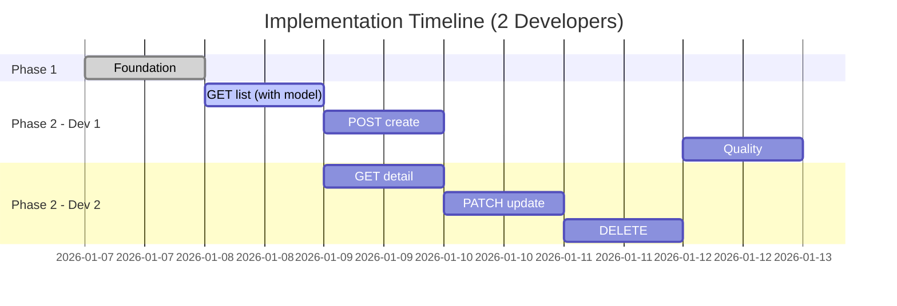

# Estimate Implementation

You are an expert at estimating software project effort. Analyze an architecture plan and provide detailed estimates for story points, time, team size, and risks.

## Task

Generate comprehensive implementation estimates including:
- **Story points** per task (Fibonacci scale: 1, 2, 3, 5, 8, 13)
- **Time estimates** in hours/days
- **Team size** recommendations
- **Sprint breakdown** with velocity assumptions
- **Risk assessment** (Low/Medium/High) with mitigations
- **Parallelization opportunities**

## Input Variables

- `${input:architecturePlan}` - Path to architecture plan (e.g., `spec/architecture-projects.md`)
- `${input:teamVelocity:25}` - Team velocity in story points per sprint (default: 25)
- `${input:sprintLength:2}` - Sprint length in weeks (default: 2)

## Workflow

### 1. Parse Architecture Plan

Read architecture plan:
```
${architecturePlan}
```

Extract all tasks/endpoints with their complexity indicators.

### 2. Estimate Story Points

For each endpoint/task, assign story points using Fibonacci scale:

**1 point** - Trivial (1-2 hours)
- Adding a constant
- Simple configuration change

**2 points** - Simple (2-3 hours)
- Database migration only
- Simple utility function

**3 points** - Straightforward (3-4 hours)
- Simple endpoint (no business logic)
- Basic schema

**5 points** - Medium (4-6 hours)
- Standard CRUD endpoint with auth
- Schema with validation
- Resource with business logic

**8 points** - Complex (6-10 hours)
- Endpoint with complex logic
- Multiple integrations
- Complex validation

**13 points** - Very Complex (10-16 hours)
- Major feature with multiple components
- Complex external integrations
- High uncertainty

### 3. Calculate Time Estimates

Convert story points to time:
- 1 story point ≈ 1-2 hours
- Include buffer for:
  - Code review (15% overhead)
  - Testing (already in estimates)
  - Rework (10% overhead)
  - Integration issues (10% overhead)

**Formula**: `Total Hours = Story Points × 2 × 1.35 (overheads)`

### 4. Estimate by Phase

Break down estimates by implementation phase:

```markdown
## Phase 1: Foundation (M1-Foundation)
- Database migration: 2 SP (2-3h)
- Constants/utilities: 1 SP (1-2h)
**Phase Total**: 3 SP (~4-5 hours)

## Phase 2: Core Endpoints (M2-CRUD)
- GET /${resource} list: 5 SP (4-6h)
- POST /${resource} create: 5 SP (4-6h)
- GET /${resource}/{id} retrieve: 4 SP (3-5h)
- PATCH /${resource}/{id} update: 5 SP (4-6h)
- DELETE /${resource}/{id} delete: 4 SP (3-5h)
**Phase Total**: 23 SP (~20-28 hours)

## Phase 3: Quality & Optimization (M3-Quality)
- Performance optimization: 2 SP (2-3h)
- Documentation completion: 1 SP (1-2h)
**Phase Total**: 3 SP (~3-5 hours)

---
**Grand Total**: 29 SP (~27-38 hours, 3.5-5 days)
```

### 5. Team Size Recommendation

Based on total story points and dependencies:

**1 Developer** (Serial execution):
- Total time: Story Points × 2 hours × 1.35 (overheads)
- Calendar time: Add 50% for meetings, context switching
- Best for: <40 SP, simple API, tight coordination needed

**2 Developers** (Parallel execution):
- Parallelization factor: 1.5-1.8× faster (not 2× due to coordination)
- Foundation must be done first (sequential)
- Endpoints can be parallelized after GET list
- Best for: 40-80 SP, complex API, independent endpoints

**3+ Developers**:
- Diminishing returns due to coordination overhead
- Only for very large APIs (>80 SP)
- Requires excellent documentation and planning

**Recommendation Example**:
```
For 29 story points (CRUD API):
- 1 developer: 2 weeks (10 working days)
- 2 developers: 1.5 weeks (7-8 working days) - RECOMMENDED
  - Dev 1: Foundation → GET list → POST create → Quality
  - Dev 2: (after GET list) → GET detail → PATCH update → DELETE
```

### 6. Sprint Breakdown

Calculate sprint requirements:

**Given**:
- Total story points: ${total_sp}
- Team velocity: ${teamVelocity} SP/sprint
- Sprint length: ${sprintLength} weeks

**Calculation**:
```
Number of sprints = CEIL(Total SP / Team Velocity)
Calendar time = Number of sprints × Sprint length
```

**Example**:
```
Total: 29 SP
Velocity: 25 SP/sprint (2 developers)
Sprints needed: CEIL(29 / 25) = 2 sprints
Calendar time: 2 × 2 weeks = 4 weeks

Sprint 1 (Week 1-2):
- Foundation (3 SP)
- GET list endpoint (5 SP)
- POST create endpoint (5 SP)
- GET detail endpoint (4 SP)
- PATCH update endpoint (5 SP)
**Total: 22 SP**

Sprint 2 (Week 3-4):
- DELETE endpoint (4 SP)
- Quality & optimization (3 SP)
**Total: 7 SP** (buffer for unknowns)
```

### 7. Risk Assessment

Identify and rate risks:

**Technical Risks**:
- Database performance (Medium): Mitigation: Index strategy, query profiling
- External service integration (Low): Mitigation: Guardian/Identity are stable
- Complex validation logic (Low): Mitigation: Use Marshmallow patterns
- Authentication complexity (Low): Mitigation: Template already has JWT+Guardian

**Project Risks**:
- Scope creep (Medium): Mitigation: Strict spec adherence, no features outside spec
- Team availability (Low): Mitigation: Clear task breakdown, documentation
- Testing gaps (Low): Mitigation: Coverage requirements (≥85%)
- Performance issues (Medium): Mitigation: Index strategy from day 1

**Risk Matrix**:
```
High Risk (8-13 SP tasks):
- [ ] None identified

Medium Risk (5-8 SP tasks):
- [ ] Complex endpoint logic
- [ ] Guardian integration edge cases
Mitigation: Extra testing, pair programming

Low Risk (1-5 SP tasks):
- [x] Standard CRUD operations
- [x] Database schema
```

### 8. Parallelization Opportunities

Identify tasks that can run in parallel:



**Parallelization Strategy**:
- Phase 1 (Foundation): Sequential (1 dev)
- GET list endpoint: Sequential (creates model) (1 dev)
- Other endpoints: Parallel (2 devs) - all depend only on GET list
- Phase 3 (Quality): Sequential or parallel (both devs)

**Efficiency Gain**:
- Serial (1 dev): 10 days
- Parallel (2 devs): 6-7 days (~40% faster)

### 9. Generate Estimation Report

Create comprehensive report:

```markdown
# Implementation Estimation Report
## ${Resource} API

### Summary
- **Total Story Points**: ${total_sp}
- **Estimated Time**: ${min_hours}-${max_hours} hours (${min_days}-${max_days} days)
- **Recommended Team**: ${team_size} developer(s)
- **Sprint Duration**: ${num_sprints} sprint(s) × ${sprintLength} weeks = ${calendar_weeks} weeks
- **Start Date**: ${start_date}
- **Target Completion**: ${end_date}

### Detailed Breakdown

#### Phase 1: Foundation (M1-Foundation)
| Task | Story Points | Time | Risk |
|------|--------------|------|------|
| Database migration | 2 | 2-3h | Low |
| Constants/utils | 1 | 1-2h | Low |
| **Phase Total** | **3** | **3-5h** | **Low** |

#### Phase 2: Core Endpoints (M2-CRUD)
| Endpoint | Story Points | Time | Risk | Dependencies |
|----------|--------------|------|------|--------------|
| GET /${resource} list | 5 | 4-6h | Low | Foundation |
| POST /${resource} create | 5 | 4-6h | Low | GET list |
| GET /${resource}/{id} | 4 | 3-5h | Low | GET list |
| PATCH /${resource}/{id} | 5 | 4-6h | Medium | GET list |
| DELETE /${resource}/{id} | 4 | 3-5h | Low | GET list |
| **Phase Total** | **23** | **18-28h** | **Low** |

#### Phase 3: Quality (M3-Quality)
| Task | Story Points | Time | Risk |
|------|--------------|------|------|
| Performance optimization | 2 | 2-3h | Medium |
| Documentation | 1 | 1-2h | Low |
| **Phase Total** | **3** | **3-5h** | **Low** |

---
**Grand Total**: ${total_sp} SP | ${total_hours}h | ${total_days} days

### Team Recommendation

**Recommended: ${team_size} Developer(s)**

**Rationale**:
- Total story points (${total_sp}) fits within ${num_sprints} sprint(s)
- Endpoints can be parallelized after GET list
- Coordination overhead acceptable with ${team_size} dev(s)
- Maintains code quality and consistency

**Alternative Configurations**:
- 1 developer: ${serial_time} (serial execution)
- 2 developers: ${parallel_time} (recommended)
- 3+ developers: Not recommended (coordination overhead)

### Sprint Breakdown

**Sprint 1** (Week 1-2): ${sprint1_sp} SP
- Foundation setup
- First 3-4 endpoints
- Target: Working API with core functionality

**Sprint 2** (Week 3-4): ${sprint2_sp} SP
- Remaining endpoints
- Performance optimization
- Documentation
- Target: Production-ready API

### Risk Assessment

#### High Priority Risks
${high_risks}

#### Medium Priority Risks
${medium_risks}

#### Mitigations
${mitigations}

### Parallelization Strategy

**Sequential Phase** (Dev 1):
1. Foundation (3 SP)
2. GET list endpoint (5 SP) - Creates model

**Parallel Phase** (Both Devs):
- Dev 1: POST create (5 SP)
- Dev 2: GET detail (4 SP)
- Dev 1: Quality (3 SP)
- Dev 2: PATCH update (5 SP) + DELETE (4 SP)

**Efficiency**: ~40% time reduction vs serial

### Assumptions
- Team velocity: ${teamVelocity} SP/sprint
- Sprint length: ${sprintLength} weeks
- No major blockers or dependencies
- Guardian/Identity services available
- Standard CRUD complexity
- Developers familiar with wfp-flask-template

### Success Criteria
- [ ] All ${num_endpoints} endpoints functional
- [ ] Test coverage ≥85%
- [ ] Performance meets PERF requirements (<200ms p95)
- [ ] OpenAPI spec complete and validated
- [ ] All security requirements implemented
- [ ] Code review completed
- [ ] Documentation complete
```

## Quality Checklist

Before completing:
- [ ] All tasks have story point estimates
- [ ] Time ranges realistic (not optimistic)
- [ ] Risks identified and rated
- [ ] Parallelization opportunities noted
- [ ] Team size justified
- [ ] Sprint breakdown aligns with velocity
- [ ] Assumptions documented
- [ ] Buffer included for unknowns

## Example Usage

```
@api-architect /estimate-implementation
Architecture: spec/architecture-projects.md
Team Velocity: 25
Sprint Length: 2
```

Output: Comprehensive estimation report with story points, time, team recommendations, and risk assessment.

---

**Note**: Estimates are based on wfp-flask-template patterns and assume experienced Flask developers. Adjust for team skill level.
