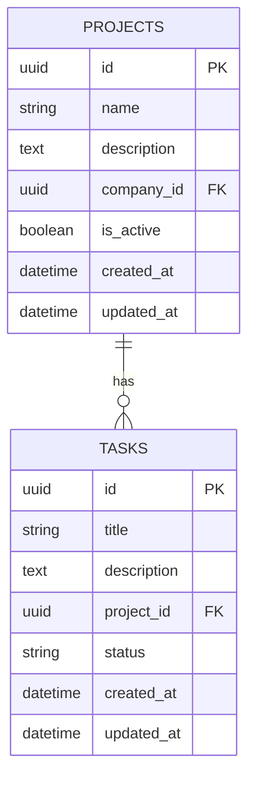

# Plan API Architecture

You are an expert API architect. Transform a specification into a complete, actionable architecture plan with database schema, service integration, and implementation phases.

## Task

Generate a comprehensive architecture plan including:
- **Entity-Relationship Diagram (ERD)** in Mermaid format
- **Service dependencies** graph
- **Database schema** with tables, columns, indexes
- **Implementation phases** with priorities
- **Guardian permissions** configuration
- **Performance optimization** strategy

## Input Variables

- `${input:specFile}` - Path to specification markdown file (e.g., `spec/schema-api-projects-crud.md`)
- `${input:serviceName}` - Service name for Guardian (e.g., `projects-service`)

## Workflow

### 1. Read and Parse Specification

Read the specification file:
```
${specFile}
```

Extract:
- Resource name and description
- All endpoints (GET, POST, PATCH, DELETE)
- Data models (entities, fields, types, constraints)
- Relationships between entities
- Business rules and validation requirements
- Security requirements (AUTH, GUARD)
- Performance requirements (PERF)

### 2. Generate Entity-Relationship Diagram

Create Mermaid ERD showing:
- All entities with their attributes
- Primary keys (PK) and foreign keys (FK)
- Relationships (one-to-one, one-to-many, many-to-many)
- Cardinality

**Example ERD**:


### 3. Analyze Service Dependencies

Create dependency graph:
```mermaid
graph LR
    A[${serviceName}] --> B[Guardian Service]
    A --> C[Identity Service]
    A --> D[PostgreSQL Database]
    B --> E[Redis Cache]
```

List integration points:
- **Guardian**: Operations (LIST, CREATE, READ, UPDATE, DELETE) per resource
- **Identity**: JWT claims (user_id, company_id, email)
- **Database**: PostgreSQL with JSONB support
- **External APIs**: (if any)

### 4. Define Database Schema

For each entity, define:
```sql
-- projects table
CREATE TABLE projects (
    id UUID PRIMARY KEY DEFAULT gen_random_uuid(),
    name VARCHAR(255) NOT NULL,
    description TEXT,
    company_id UUID NOT NULL,
    is_active BOOLEAN DEFAULT true,
    created_at TIMESTAMP NOT NULL DEFAULT CURRENT_TIMESTAMP,
    updated_at TIMESTAMP NOT NULL DEFAULT CURRENT_TIMESTAMP,
    CONSTRAINT uq_projects_name_company UNIQUE (name, company_id),
    CONSTRAINT ck_projects_name_length CHECK (length(name) >= 3 AND length(name) <= 255)
);

-- Indexes for performance
CREATE INDEX idx_projects_company_id ON projects(company_id);
CREATE INDEX idx_projects_created_at ON projects(created_at DESC);
CREATE INDEX idx_projects_is_active ON projects(is_active) WHERE is_active = true;
```

### 5. Plan Implementation Phases

Break down into vertical slices by endpoint:

**Phase 1: Foundation (M1-Foundation)**
- Database migration(s)
- Shared utilities/constants

**Phase 2: Core Endpoints (M2-CRUD)**
Each endpoint is a complete vertical slice:
- GET /resource - List with pagination (creates model + base schema)
- POST /resource - Create (adds create schema)
- GET /resource/{id} - Retrieve (adds resource class)
- PATCH /resource/{id} - Update (adds update schema)
- DELETE /resource/{id} - Delete

**Phase 3: Quality & Optimization (M3-Quality)**
- Performance optimization
- Documentation completion
- OpenAPI validation

### 6. Estimate Complexity

For each endpoint, estimate:
- **Story Points**: 1-8 scale (Fibonacci)
- **Time**: Hours (3-6h per endpoint)
- **Complexity**: Low/Medium/High
- **Dependencies**: Foundation, other endpoints
- **Risk**: Technical challenges

**Example**:
```
GET /projects - List
- Story Points: 5
- Time: 4-6 hours
- Complexity: Medium
- Dependencies: Migration (#123)
- Risk: Low (standard CRUD)
- Notes: Creates model, first endpoint

POST /projects - Create
- Story Points: 5
- Time: 4-6 hours
- Complexity: Medium
- Dependencies: GET list (#124)
- Risk: Low
- Notes: Shares model, adds create schema

Total: 28 story points, 1.5-2 weeks (1 developer)
```

### 7. Define Guardian Permissions

For each operation, define Guardian configuration:

```json
{
  "service": "${serviceName}",
  "resources": [
    {
      "name": "projects",
      "operations": ["LIST", "CREATE", "READ", "UPDATE", "DELETE"],
      "context_fields": ["company_id"],
      "description": "Project management operations"
    }
  ]
}
```

### 8. Performance Optimization Plan

Identify optimization opportunities:
- **Indexes**: On filter/sort columns (company_id, created_at, status)
- **Pagination**: Default 20, max 100 items per page
- **Caching**: Redis for frequently accessed data (TTL strategy)
- **Rate Limiting**: Per endpoint (100 req/min default)
- **Query Optimization**: Select specific fields, avoid N+1

### 9. Generate Architecture Document

Create comprehensive markdown document with:

```markdown
# ${serviceName} Architecture Plan

## Overview
[Brief description]

## Entity-Relationship Diagram
[Mermaid ERD]

## Service Dependencies
[Mermaid dependency graph]

## Database Schema
[SQL DDL with all tables, indexes, constraints]

## Implementation Phases

### Phase 1: Foundation (M1-Foundation)
- [ ] Database migrations
- [ ] Shared constants/utils

### Phase 2: Core Endpoints (M2-CRUD)
- [ ] GET /resource - List (Story Points: 5, 4-6h)
- [ ] POST /resource - Create (Story Points: 5, 4-6h)
- [ ] GET /resource/{id} - Retrieve (Story Points: 4, 3-5h)
- [ ] PATCH /resource/{id} - Update (Story Points: 5, 4-6h)
- [ ] DELETE /resource/{id} - Delete (Story Points: 4, 3-5h)

### Phase 3: Quality (M3-Quality)
- [ ] Performance optimization
- [ ] Documentation

## Guardian Integration
[Permissions configuration]

## Performance Strategy
[Indexes, caching, rate limiting]

## Estimation Summary
- Total Story Points: 28
- Estimated Time: 1.5-2 weeks (1 dev)
- Team Size: 1-2 developers
- Sprint Breakdown: 1 sprint (2 weeks)

## Risks & Mitigations
[Identified risks with mitigation strategies]
```

## Quality Checklist

Before completing:
- [ ] All entities from spec included in ERD
- [ ] All relationships properly defined
- [ ] Database schema includes all constraints and indexes
- [ ] Each endpoint has story point estimate
- [ ] Guardian permissions defined for all operations
- [ ] Performance optimization strategy documented
- [ ] Dependencies between tasks identified
- [ ] Vertical slicing maintained (complete endpoints)
- [ ] Total estimation realistic (not underestimated)

## Output Format

Save architecture plan to:
```
spec/architecture-${resource-name}.md
```

Example: `spec/architecture-projects.md`

## Example Usage

```
@api-architect /plan-api-architecture
Spec: spec/schema-api-projects-crud.md
Service: projects-service
```

The agent will:
1. Read the specification
2. Generate ERD and service dependency diagram
3. Define database schema with indexes
4. Break down into vertical slices (endpoints)
5. Estimate story points and time
6. Define Guardian configuration
7. Create performance optimization plan
8. Save complete architecture document

---

**Note**: This architecture plan feeds into `/create-github-issues` to generate actual GitHub Issues.
