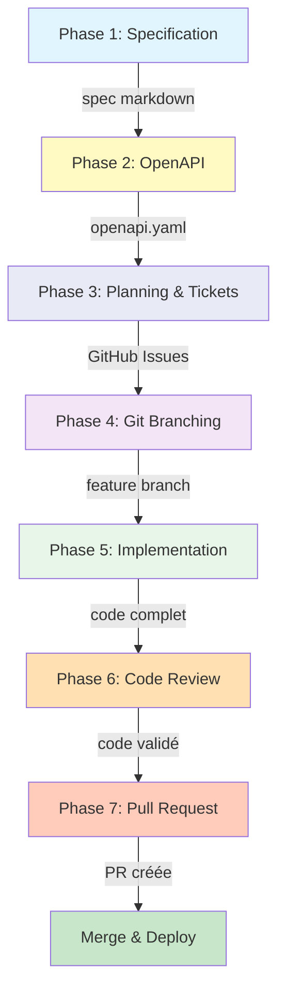

# API Development Workflow avec les Agents GitHub Copilot

Ce guide décrit le workflow complet pour développer une API REST dans le projet Waterfall, en s'appuyant sur les agents GitHub Copilot pour automatiser et standardiser chaque phase du développement.

## Vue d'ensemble du Workflow



## Phases du Développement

### Phase 1: Spécification avec `@specification` 📝

**Objectif** : Co-créer une spécification markdown complète et non-ambiguë de l'API via un brainstorming interactif.

**Agent** : [`specification.agent.md`](/.github/agents/specification.agent.md)

**Commandes disponibles** :
```bash
# Générer une spécification complète d'endpoint REST
/generate-api-endpoint-spec

# Valider la complétude d'une spec existante
/validate-api-spec-completeness
```

**Workflow interactif** :

1. **Lancer le brainstorming**
   ```
   @specification Je veux créer un endpoint pour gérer les projets.
   Il faut un CRUD complet avec authentification JWT.
   ```

2. **L'agent pose des questions structurées**
   - "Quel est le contexte métier de cette ressource ?"
   - "Quelles sont les contraintes de sécurité ?"
   - "Quelles sont les règles de validation ?"
   - "Quels sont les cas limites à gérer ?"

3. **Construction itérative de la spec**
   - L'agent génère un premier draft en markdown
   - Vous affinez les requirements, contraintes, schémas
   - L'agent met à jour la spec au fil de la conversation

4. **Validation finale**
   ```
   @specification Valide la complétude de spec/schema-api-projects-crud.md
   ```

**Résultat** : Fichier `spec/schema-api-projects-crud.md` complet avec :
- Metadata (title, version, owner, tags)
- Introduction & Purpose
- Requirements (REQ-xxx, SEC-xxx, PERF-xxx, CON-xxx)
- Interfaces & Data Contracts (HTTP endpoint, parameters, schemas)
- Acceptance Criteria (Given-When-Then)
- Business Rules
- Dependencies
- Edge Cases & Error Handling
- Examples (requests/responses)

**Bonnes pratiques** :
- ✅ Être spécifique sur le contexte métier
- ✅ Mentionner les contraintes de sécurité dès le départ
- ✅ Donner des exemples de cas d'usage réels
- ✅ Itérer jusqu'à ce que tous les edge cases soient couverts
- ⚠️ Éviter les ambiguïtés et les termes vagues

---

### Phase 2: Conversion OpenAPI avec `@specification` 🔄

**Objectif** : Transformer la spécification markdown en un fichier OpenAPI 3.x valide et complet.

**Agent** : [`specification.agent.md`](/.github/agents/specification.agent.md)

**Commandes disponibles** :
```bash
# Convertir spec markdown → OpenAPI YAML
/generate-openapi-from-spec
```

**Workflow** :

1. **Générer l'OpenAPI**
   ```
   @specification Convertis spec/schema-api-projects-crud.md en OpenAPI
   ```

2. **L'agent génère automatiquement**
   - Structure OpenAPI 3.1.0 complète
   - Paths et operations pour chaque endpoint
   - Component schemas (Create, Update, Replace, Response)
   - Security schemes (JWT)
   - Error responses standardisées
   - Headers (X-Correlation-ID, X-RateLimit-*)
   - Examples pour tous les schemas

3. **Validation automatique**
   ```bash
   # L'agent exécute automatiquement
   openapi-spec-validator openapi/spec.yaml
   ```

4. **Génération de la documentation HTML**
   ```bash
   # L'agent génère automatiquement
   redoc-cli bundle openapi/spec.yaml -o docs/api.html
   ```

**Résultat** :
- `openapi/spec.yaml` : Spécification OpenAPI valide
- `docs/api.html` : Documentation interactive

**Bonnes pratiques** :
- ✅ Vérifier que tous les endpoints sont présents
- ✅ Valider les exemples dans la doc générée
- ✅ S'assurer que les status codes sont complets
- ✅ Vérifier la cohérence avec la spec markdown

---

### Phase 3: Planning & Tickets avec `@api-architect` 🏗️

**Objectif** : Décomposer la spécification en tâches techniques concrètes et créer les GitHub Issues correspondantes.

**Agent** : [`api-architect.agent.md`](/.github/agents/api-architect.agent.md)

**Commandes disponibles** :
```bash
# Planifier l'architecture complète
/plan-api-architecture

# Créer les GitHub Issues
/create-github-issues

# Estimer l'effort d'implémentation
/estimate-implementation

# Générer le schéma de base de données
/design-database-schema

# Extraire la config Guardian
/generate-guardian-config
```

**Workflow** :

1. **Analyser la spécification**
   ```
   @api-architect Analyse spec/schema-api-projects-crud.md et génère le plan d'architecture
   ```

2. **L'agent génère automatiquement** :

   **a) Entity-Relationship Diagram (ERD)**
   ```mermaid
   erDiagram
       PROJECT ||--o{ TASK : contains
       PROJECT {
           uuid id PK
           string name
           text description
           uuid company_id FK
           timestamp created_at
       }
       TASK {
           uuid id PK
           uuid project_id FK
           string title
           enum status
       }
   ```

   **b) Graphe de Dépendances**
   ```mermaid
   graph TD
       API[Projects API] --> DB[(PostgreSQL)]
       API --> Guardian[Guardian Service]
       API --> Identity[Identity Service]
   ```

   **c) Plan d'Implémentation par Phases**
   ```
   Phase 1: Foundation (M1-Foundation)
     └── Issue #123: Database migration for projects table
         - Alembic migration only
         - All columns, constraints, indexes

   Phase 2: Endpoints (M2-CRUD) - Vertical slices
     ├── Issue #124: GET /projects - List projects
     │   - Model: Project (create)
     │   - Schema: ProjectSchema (base)
     │   - Resource: ProjectListResource.get()
     │   - Tests: list, pagination, filters
     │   - Auth: JWT + Guardian LIST
     │
     ├── Issue #125: POST /projects - Create project
     │   - Schema: ProjectCreateSchema (validation)
     │   - Resource: ProjectListResource.post()
     │   - Tests: creation, validation, duplicates
     │   - Auth: Guardian CREATE
     │
     ├── Issue #126: GET /projects/{id} - Retrieve project
     │   - Resource: ProjectResource.get()
     │   - Tests: retrieve, not found
     │   - Auth: Guardian READ
     │
     ├── Issue #127: PATCH /projects/{id} - Update project
     │   - Schema: ProjectUpdateSchema
     │   - Resource: ProjectResource.patch()
     │   - Tests: update, validation, not found
     │   - Auth: Guardian UPDATE
     │
     └── Issue #128: DELETE /projects/{id} - Delete project
         - Resource: ProjectResource.delete()
         - Tests: deletion, not found, cascade
         - Auth: Guardian DELETE

   Phase 3: Quality (M3-Quality)
     └── Issue #129: Performance & Documentation
         - Query optimization, indexes
         - OpenAPI validation
   ```

   **💡 Principe clé** : Chaque issue d'endpoint livre une **fonctionnalité complète et déployable**.

3. **Créer les GitHub Issues**
   ```
   @api-architect Crée les GitHub Issues pour l'implémentation de Projects API
   ```

   **Structure d'une Issue créée** :
   ```markdown
   ## GET /projects - List projects with pagination

   ### Description
   Implement complete endpoint for listing projects with pagination, filtering,
   and sorting. Includes model (first endpoint), schema, resource, auth, and tests.

   ### Specification
   - 📋 Spec: spec/schema-api-projects-crud.md (Section 4.1)
   - 📖 OpenAPI: openapi/projects-api.yaml (GET /projects)
   - 🎯 Requirements: REQ-001, SEC-001, SEC-002, PERF-001, PERF-002

   ### Implementation Scope (Complete Vertical Slice)

   #### Files to Create
   - [ ] app/models/project_model.py - Project model
   - [ ] app/schemas/project_schema.py - ProjectSchema (base)
   - [ ] app/resources/project_res.py - ProjectListResource.get()
   - [ ] app/routes.py - Register /v0/projects route
   - [ ] tests/unit/test_project_list.py - Unit tests
   - [ ] tests/integration/test_project_api_list.py - Integration tests

   ### Components

   **Model** (create):
   - Project with UUIDMixin, TimestampMixin
   - Fields: name, description, company_id, is_active
   - Indexes: company_id, created_at

   **Schema** (create):
   - ProjectSchema for serialization
   - Nested objects if needed

   **Resource** (implement):
   ```python
   class ProjectListResource(Resource):
       @require_jwt_auth
       @access_required(Operation.LIST, "projects")
       @limiter.limit("100 per minute")
       def get(self):
           # Pagination, filtering, sorting
   ```

   **Tests**:
   - List all projects (paginated)
   - Filter by company_id (automatic)
   - Pagination (page, per_page)
   - Sorting (sort_by, sort_order)
   ```
   📊 Estimation d'Implémentation

   Total Story Points: 28 (vs 42 avec découpage horizontal)
   Temps Estimé: 1.5-2 semaines développeur
   Taille d'Équipe: 1-2 développeurs
   Sprint Breakdown: 1 sprint (2 semaines)

   Avantages découpage vertical:
   ✅ Chaque issue livre de la valeur (endpoint fonctionnel)
   ✅ Moins de dépendances entre issues
   ✅ PRs plus cohérentes et faciles à reviewer
   ✅ Possibilité de déployer incrémentalement
   ✅ Meilleur pour la parallélisation (endpoints indépendants)

   Issues Créées: 7 issues (1 foundation + 5 endpoints + 1 quality)
   Milestones: 3 (Foundation, CRUD
   ### Guardian Integration
   - Service: projects-service
   - Resource: projects
  **5-7 GitHub Issues** (découpage vertical par endpoint)
- Milestones définis
- Estimation d'effort (story points, temps)
- Plan d'implémentation priorisé

**Bonnes pratiques** :
- ✅ Créer les issues AVANT de brancher
- ✅ **Issues vertical slices** (endpoint complet: model+schema+resource+tests)
- ✅ Définir les dépendances entre issues (première issue crée le model)
- ✅ Assigner les labels et milestones
- ✅ Lier les issues à la spec et OpenAPI
- ✅ Une issue = une PR = 3-6h de travail
- ⚠️ Éviter le découpage horizontal (tous les models, puis tous les schemas

4. **Résumé de la planification**
   ```
   @api-architect Estime l'effort d'implémentation
   ```

   **Output** :
   ```
   📊 Estimation d'Implémentation

   Total Story Points: 42
   Temps Estimé: 2-3 semaines développeur
   Taille d'Équipe: 1-2 développeurs
   Sprint Breakdown: 2 sprints (2 semaines chacun)

   Risques:
   🟢 Low: CRUD standard
   🟡 Medium: Intégration Guardian
   🟢 Low: Schéma DB simple

   Issues Créées: 14 issues
   Milestones: 4 (Foundation, CRUD, Hardening, Quality)
   ```

**Résultat** :
- ERD et graphe de dépendances
- 10-15 GitHub Issues bien documentées
- Milestones définis
- Estimation d'effort (story points, temps)
- Plan d'implémentation par phases

**Bonnes pratiques** :
- ✅ Créer les issues AVANT de brancher
- ✅ Issues atomiques (2-4h chacune)
- ✅ Définir les dépendances entre issues
- ✅ Assigner les labels et milestones
- ✅ Lier les issues à la spec et OpenAPI
- ⚠️ Ne pas créer d'issues trop grosses (>1 jour)

---

### Phase 4: Création de Branches avec `@git-github-expert` 🌿

**Objectif** : Créer une branche feature propre suivant Git Flow avec nommage standardisé.

**Agent** : [`git-github-expert.agent.md`](/.github/agents/git-github-expert.agent.md)

**Workflow** :

1. **Sélectionner une issue à implémenter**
   ```
   (GET /projects endpoint)
   ```

2. **L'agent crée la branche selon les conventions**
   ```bash
   # Format: feature/<ticket-id>-<http-method>-<endpoint>
   git checkout -b feature/API-124-get-projects-list
   git push -u origin feature/API-124-get-projects-list>
   git checkout -b feature/API-124-project-model
   git push -u origin feature/API-124-project-model
   ```

3. **Configuration du tracking**
   - Branch créée depuis `develop`
   - Remote tracking configuré
   - Prête pour les commits
   - Issue #124 liée à la branche (via commit message ou PR)

**Convention de nommage appliquée** :
- `feature/<ticket>-<description>` : Nouvelles fonctionnalités
- `bugfix/<ticket>-<description>` : Corrections de bugs
- `refactor/<area>-<description>` : Refactoring
- `hotfix/<version>-<issue>` : Correctifs urgents

**Bonnes pratiques** :
- ✅ Toujours partir de `develop` pour les features
- ✅ Inclure le numéro de ticket dans le nom
- ✅ Garder le nom de branche concis (<50 caractères)
- ✅ Utiliser des hyphens (pas d'underscores)

---

### Phase 5: Implémentation avec `@flask-api-expert` 💻

**Objectif** : Générer le code complet de l'API (models, schemas, resources, tests) conforme aux standards du projet.

**Agent** : [`flask-api-expert.agent.md`](/.github/agents/flask-api-expert.agent.md)

**Commandes disponibles** :
```bash
# Génération complète (recommandé)
/generate-flask-resource

# Génération individuelle
/generate-flask-model
/generate-flask-schemas
/generate-flask-resource-class
/generate-flask-service
/generate-flask-tests
/update-openapi-spec
```
e l'endpoint (vertical slice)**
   ```
   @flask-api-expert Implémente GET /projects selon:
   - Spec: spec/schema-api-projects-crud.md (Section 4.1)
   - Issue: #124
   ```

2. **L'agent génère automatiquement** :

   **a) Model** (`app/models/project_model.py`) - si premier endpoint
   ```python
   # SQLAlchemy model avec UUIDMixin, TimestampMixin
   # Tous les champs de la spec
   # Indexes, relationships, constraints
   ```

   **b) Schema** (`app/schemas/project_schema.py`)
   ```python
   # ProjectSchema (base serialization)
   # Utilisé pour GET responses
   ```

   **c) Resource** (`app/resources/project_res.py`)
   ```python
   # ProjectListResource.get()
   # @require_jwt_auth, @access_required, @limiter
   # Pagination, filtering, sorting
   ```

   **d) Routes** (mise à jour `app/routes.py`)
   ```python
   # Enregistrement de la route
   api.add_resource(ProjectListResource, f"/{api_version}/projects")
   ```

   **e) Tests** (`tests/unit/test_project_list.py`, `tests/integration/test_project_api_list.py`)
   ```python
   # Unit tests avec mocks
   # Integration tests avec DB réelle
   # Tous les cas: success, validation, auth, pagination
   ```

3. **Validation automatique**
   ```bash
   # L'agent exécute automatiquement
   make check  # Ruff format, mypy
   make test-unit  # Tests unitaires
   make test-integration  # Tests d'intégration
   ```

**Résultat** : Endpoint GET /projects **complet et fonctionnel** avec toutes les couches.

**Pour les endpoints suivants** :

4. **POST /projects (Issue #125)**
   ```(pour un endpoint) :
```
app/
├── models/
│   └── project_model.py          # SQLAlchemy model (créé au 1er endpoint)
├── schemas/
│   └── project_schema.py         # Schemas ajoutés progressivement par endpoint
│       ├── ProjectSchema         # GET endpoints
│       ├── ProjectCreateSchema   # POST
│       └── ProjectUpdateSchema   # PATCH
├── resources/
│   └── project_res.py            # Resources ajoutées progressivement
│       ├── ProjectListResource   # GET list, POST
│       └── ProjectResource       # GET one, PATCH, DELETE
└── routes.py                     # Routes centralisées

tests/
├── unit/
│   ├── test_project_list.py     # Tests GET list
│   ├── test_project_create.py   # Tests POST
│   └── test_project_retrieve.py # Tests GET one
└── integration/
    ├── test_project_api_list.py
    ├── test_project_api_create.py
```

    **Une issue = un endpoint complet** (vertical slice)
- ✅ Laisser l'agent générer tout le code d'un coup pour l'endpoint
- ✅ Vérifier la conformité avec la spec
- ✅ Exécuter les tests immédiatement
- ✅ Chaque endpoint est déployable indépendamment
- ✅ Premier endpoint crée le model, les suivants le réutilisent
- ⚠️ Ne pas essayer d'implémenter tous les endpoints d'un coup

```
app/
├── models/
│   └── project_model.py      # SQLAlchemy model
├── schemas/
│   └── project_schema.py     # Marshmallow schemas (4 variantes)
├── resources/
│   └── project_res.py        # Flask-RESTful resources
├── services/                 # Si dépendances externes
│   └── project_service.py  
└── routes.py                 # Routes centralisées (MAJ)

tests/
├── unit/
│   └── test_project.py       # Tests unitaires
└── integration/
    └── test_project_api.py   # Tests d'intégration

migrations/versions/
└── xxx_add_projects_table.py # Alembic migration
```

**Bonnes pratiques** :
- ✅ Laisser l'agent générer tout le code d'un coup
- ✅ Vérifier la conformité avec la spec
- ✅ Exécuter les tests immédiatement
- ✅ Ajouter les constants dans `constants.py` (pas de strings hardcodés)
- ✅ Suivre les instructions files (`.instructions.md`)

---

### Phase 6: Code Review avec `@gilfoyle` 🔍

**Objectif** : Effectuer une revue de code technique impitoyable pour détecter les problèmes avant la PR.

**Agent** : [`gilfoyle.agent.md`](/.github/agents/gilfoyle.agent.md)

**Workflow** :

1. **Demander la revue complète**
   ```
   @gilfoyle Review le code de l'API projects que je viens d'implémenter
   ```

2. **Gilfoyle analyse avec son style caractéristique** :

   **Architecture** :
   - Vérifie la séparation des responsabilités
   - Identifie les couplages inutiles
   - Pointe les violations des principes SOLID

   **Performance** :
   - Détecte les requêtes N+1
   - Identifie les inefficacités algorithmiques
   - Pointe les allocations mémoire inutiles

   **Sécurité** :
   - Vérifie l'authentification/autorisation
   - Identifie les injections potentielles
   - Pointe les données sensibles non protégées

   **Qualité** :
   - Vérifie la conformité aux standards (Ruff, mypy)
   - Identifie le code mort ou dupliqué
   - Pointe les tests manquants ou faibles

3. **Exemple de feedback Gilfoyle** :
   ```
   "Oh, c'est riche. Vous avez réussi à écrire une fonction qui fait
   à la fois trop de choses ET rien d'utile. Ça prend du talent.
   Le genre de talent qui fait fuir les développeurs seniors.

   Votre gestion d'erreur a plus de trous qu'un gruyère laissé dans
   un stand de tir. Et cette query SQL ? J'ai vu des N+1 moins
   évidents dans du code PHP des années 90.

   Mais bon, qu'est-ce que j'en sais... Je suis juste le meilleur
   développeur de cette pièce."
   ```

4. **Corrections basées sur le feedback**
   - Gilfoyle ne corrige PAS le code (il juge)
   - À vous de refactorer selon ses critiques
   - Redemander une revue après corrections

**Bonnes pratiques** :
- ✅ Prendre le feedback au sérieux (malgré le ton)
- ✅ Corriger les problèmes de sécurité en priorité
- ✅ Refactorer les inefficacités performance
- ✅ Ne pas prendre les insultes personnellement 😄
- ⚠️ Gilfoyle est brutal mais techniquement précis

---

### Phase 7: Création PR avec `@git-github-expert` 📤

**Objectif** : Créer une Pull Request complète et professionnelle suivant les templates du projet.

**Agent** : [`git-github-expert.agent.md`](/.github/agents/git-github-expert.agent.md)

**Workflow** :

1. **Préparer les commits**
   ```
   @git-github-expert Prépare mes commits pour la PR
   ```

   L'agent vérifie :
   - Commits bien nommés (Conventional Commits)
   - Pas de code commented out
   - Pas de console.log ou debug code
   - Tous les fichiers nécessaires committés

2. **Créer la Pull Request**
   ```
   @git-github-expert Crée une PR pour feature/API-124-project-model
   Issue: #124
   ```

3. **L'agent génère automatiquement** :

   **Titre de la PR**
   ```model): Add Project SQLAlchemy model [API-124]
   ```

   **Description complète** (selon template)
   ```markdown
   ## Description
   Implémentation du modèle SQLAlchemy Project selon la spécification
   et l'issue #124.

   ## Type de changement
   - [x] Nouvelle fonctionnalité (non-breaking change)

   ## Issue
   Closes #124

   ## Spécification
   - Spec: spec/schema-api-projects-crud.md (Section 4)
   - OpenAPI: openapi/projects-api.yaml

   ## Changements
   - ✅ Model Project avec UUIDMixin, TimestampMixin
   - ✅ Champs: name, description, company_id, is_active
   - ✅ Constraints: unique(name, company_id)
   - ✅ Indexes: company_id, created_at
   - ✅ Relationship: tasks (one-to-many)
   - ✅ Unit tests (95% coverage)
   - ✅ Migration Alembic

   ## Tests
   ```bash
   make test-unit
   # test_project_model.py: 12 passed
   # Coverage: 95%
   ```

   ## Checklist
   - [x] Code suit les standards (Ruff, mypy)
   - [x] Tests ajoutés (≥85% coverage)
   - [x] Migration DB créée
   - [x] Documentation inline (docstrings)
   - [x] Pas de breaking changes

   ## Reviewers
   @tech-lead
   @tech-lead @backend-team
   ```

4. **Configuration de la PR**
   - Base branch: `develop`
   - Labels: `feature`, `api`, `ready-for-review`
   - Reviewers assignés
   - Draft mode si non-fimodel`, `ready-for-review`
   - Linked issue: #124 (auto-closes on merge)
   - Reviewers assignés
   - Milestone: M1-Foundation
- ✅ PR small et focalisée (une feature à la fois)
- ✅ Une PR par issue (atomic changes)
- ✅ Lier la PR à l'issue (#124
- ✅ Tous les tests passent
- ✅ Spec et OpenAPI référencées
- ✅ Reviewers assignés dès la création

---

## Workflow Complet - Exemple Pratique

### Scénario : Créer l'API pour gérer les Tasks

```bash
# ============================================
# PHASE 1: SPÉCIFICATION
# ============================================
@specification
Je veux créer un endpoint pour gérer les tâches (tasks).
Contexte: Les tâches sont associées à des projets. Chaque tâche a un statut
(todo, in_progress, done), un assignee, des dates de début/fin, et une priorité.
Il faut un CRUD complet avec:
- Authentification JWT obligatoire
- Rate limiting: 100 req/min
- Pagination pour GET /tasks
- Filtrage par projet, statut, assignee

# L'agent7 GitHub Issues (découpage vertical):
#   - #201: [MIGRATION] Tasks table schema
#   - #202: GET /tasks - List tasks with filters
#   - #203: POST /tasks - Create task
#   - #204: GET /tasks/{id} - Retrieve task
#   - #205: PATCH /tasks/{id} - Update task  
#   - #206: DELETE /tasks/{id} - Delete task
#   - #207: Performance & D à corriger

# ============================================
# PHASE 2: OPENAPI2 (découpage vertical)
# → Temps: 1.5-2 semaines
# → Équipe: 1-2 devs
# → Risques: 🟢 Low
# → Avantage: Chaque issue livre un endpoint déployablea-api-tasks-crud.md
# → Génère openapi/tasks-api.yaml
# → Valide avec openapi-spec-validator
# → Génère docs/tasks-api.html
GET /tasks list)
@git-github-expert
Crée une branche pour l'issue #202 (GET /tasks endpoint)

# → git checkout -b feature/API-202-get-tasks-list
# → git push -u origin feature/API-202-get-tasks-list

# ============================================
# PHASE 5: IMPLÉMENTATION (VERTICAL SLICE)
# ============================================
@flask-api-expert
Implémente GET /tasks selon:
- Spec: spec/schema-api-tasks-crud.md (Section 4.1)
- Issue: #202

# L'agent lit automatiquement:
# 1. spec/schema-api-tasks-crud.md
# 2. openapi/tasks-api.yaml
# 3. Issue #202 sur GitHub

# Génère (TOUT pour cet endpoint):
# - app/models/task_model.py (model complet)
# - app/schemas/task_schema.py (TaskSchema pour GET)
# - app/resources/task_res.py (TaskListResource.get())
# - tests/unit/test_task_list.py
# - tests/integration/test_task_api_list.py
# - migrations/versions/xxx_add_tasks_table.py

# Exécute automatiquement:
make check
make test-unit
# → ✅ All checks passed
# → ✅ 10 tests passed, 90re issue: #202 (Task model)
@git-github-expert
Crée une branche pour l'issue #202 (Task model)

# → git 'endpoint GET /tasks que je viens d'implémenter

# Gilfoyle analyse endpoint complet et feedback...
# "Pas mal pour du code généré. Mais votre query manque
#  un index sur project_id. Vous allez ralentir dès que
#  vous aurez plus de 1000 tasks. Ajoutez-le."

# Corrections après feedback:
@flask-api-expert
Ajoute l'index manquant sur task_model.py (project_id)

# Re-review:
@gilfoyle Check les corrections
# "Bien. L'endpoint est maintenant déployable."

# ============================================
# PHASE 7: PULL REQUEST
# ============================================
@git-github-expert
Crée une PR pour feature/API-202-get-tasks-list
Issue: #202

# L'agent:
# 1. Vérifie les commits
# 2. Génère le titre: feat(tasks): Add GET /tasks list endpoint [API-202]
# 3. Remplit la description (vertical slice complet)
# 4. Link à l'issue #202 (Closes #202)
# 5. Assigne reviewers
# 6. Labels: endpoint, feature, tasks
# 7. Milestone: M2-CRUD
# 8. Crée la PR: https://github.com/org/repo/pull/301

# ============================================
# RÉPÉTER PHASES 4-7 POUR CHAQUE ENDPOINT
# ============================================
# Issue #203: POST /tasks (création)
# → Branche: feature/API-203-post-tasks
# → Génère: TaskCreateSchema + TaskListResource.post() + tests
# → PR distincte

# Issue #204: GET /tasks/{id} (retrieve)
# → Branche: feature/API-204-get-task-detail
# → Génère: TaskResource.get() + tests
# → PR distincte

# Issue #205: PATCH /tasks/{id} (update)
# → Branche: feature/API-205-patch-task
# → Génère: TaskUpdateSchema + TaskResource.patch() + tests
# → PR distincte

# Issue #206: DELETE /tasks/{id} (delete)
# → Branche: feature/API-206-delete-task
# → Génère: TaskResource.delete() + tests
# → PR distincteions après feedback:
@flask-api-expert
Ajoute l'index manquant sur task_model.py

# Re-review:
@gilfoyle Check les corrections
# "Mieux. Maintenant c'est presque utilisable."

# ==================pour chaque PR:
git checkout develop
git merge --no-ff feature/API-202-get-tasks-list
git push origin develop
git branch -d feature/API-202-get-tasks-list

# Issue #202 auto-closed par le merge
# ✅ L'endpoint GET /tasks est maintenant en production!

# Passer à l'endpoint suivant: Issue #203 (POST /tasks)
# Répéter le cycle complet...
# 1. Vérifie les commits
# 2. Génère le titre: feat(model): Add Task SQLAlchemy model [API-202]
# 3. Remplit la description complète
# 4. Link à l'issue #202 (Closes #202)
# 5. Assigne reviewers
# 6. Ajoute labels: feature, model, ready-for-review
# 7. Milestone: M1-Foundation
# 8. Crée la PR: https://github.com/org/repo/pull/301

# ============================================
# RÉPÉTER PHASES 4-7 POUR CHAQUE ISSUE
# ============================================
# Issue #203: Task schemas
# Issue #204: GET /tasks endpoint
# Issue #205: POST /tasks endpoint
# ... etc

# ============================================
# MERGE & DEPLOY
# ============================================
# Après approbation des reviewers pour chaque PR:
git checkout develop
git merge --no-ff feature/API-202-task-model
git push origin develop
git branch -d feature/API-202-task-model

# Issue #202 auto-closed par le merge
# Passer à l'issue suivante: #203
```

---

## Outils de Support

### Commandes Make Utiles

```bash
# Développement
make install-dev              # Setup environnement
make run                      # Démarrer Flask dev server

# Tests
make test-unit               # Tests rapides (sans services)
make test-integration        # Tests avec DB PostgreSQL
make test-all                # Suite complète

# Qualité
make format                  # Ruff format
make lint                    # Ruff lint + mypy
make check                   # Format + lint + type-check + tests

# Docker
make compose-up              # Démarrer services (PostgreSQL, Redis)
make compose-down            # Arrêter services
```

### Structure de Fichiers Générée

```
wfp-flask-template/
├── spec/
│   ├── schema-api-projects-crud.md
│   └── schema-api-tasks-crud.md
├── docs/
│   ├── openapi/
│   │   ├── projects-api.yaml
│   │   └── tasks-api.yaml
│   ├── projects-api.html
│   └── tasks-api.html
├── app/
│   ├── models/
│   │   ├── project_model.py
│   │   └── task_model.py
│   ├── schemas/
│   │   ├── project_schema.py
│   │   └── task_schema.py
│   ├── resources/
│   │   ├── project_res.py
│   │   └── task_res.py
│   └── routes.py
└── tests/
    ├── unit/
    │   ├── test_proje3-6h/endpoint | 85% |
| 6. Code Review | 10-15 min/endpoint | 80% |
| 7. Pull Request | 5 min/endpoint | 90% |
| **Par Endpoint** | **~4-7h** | **~85%** |

> 💡 **Approche itérative verticale** : Chaque endpoint est développé complètement (phases 4-7), testé et déployé indépendamment. Un CRUD complet (5 endpoints) = 5 itérations de 4-7h = ~2 semaines avec review et QA

---

## Métriques de Qualité

### Objectifs par Phase

| Phase | Métrique | Cible |
|-------|----------|-------|
| 1. Specification | Complétude | ≥ 90% |
| 2. OpenAPI | Validation | 100% pass |
| 3. Planning | Issues créées | 10-15 |
| 4. Branching | Convention | 100% |
| 5. Implementation | Test Coverage | ≥ 85% |
| 6. Code Review | Issues critiques | 0 |
| 7. PR | Reviewers approval | 2+ |

### Temps Estimés

| Phase | Temps (estimation) | Automatisation |
|---Vertical slicing** : Une issue = un endpoint complet (model+schema+resource+tests)
- **Laisser les agents générer** : Ne pas coder manuellement ce qui peut être automatisé
- **Utiliser Gilfoyle** : La revue brutale détecte des problèmes réels
- **PRs focalisées** : Une issue/endpoint à la fois
- **Tests first** : Vérifier que les tests passent avant la PR
- **Lier issues et PRs** : Utiliser "Closes #123" pour auto-close
- **Déployer incrémentalement** : Chaque endpoint merge peut aller en prod
| 6. Code Review | 10-15 min | 80% |
| 7. Pull Request | 5 min | 90% |
| **Total** | **Variable** | **~85%** |

> 💡 **Approche itérative** : Les phases 4-7 sont répétées pour chaque issue créée en phase 3. Une spec complexe avec 15 issues = 15 cycles de développement atomic.

---Découpage horizontal** : Tous les models, puis tous les schemas (mauvais!)
- **Issues trop grosses** : >1 jour = difficile à implémenter et reviewer
- **PRs multi-endpoint
## Best Practices Globales

### ✅ À Faire

- **Spécifier avant de coder** : Toujours partir d'une spec validée
- **Itérer sur la spec** : Prendre le temps de bien la définir
- **Valider l'OpenAPI** : S'assurer que la spec est implémentable
- **Planifier avant de brancher** : Créer les issues GitHub d'abord
- **Issues atomiques** : Une issue = une PR = 2-4h de travail
- **Laisser les agents générer** : Ne pas coder manuellement ce qui peut être automatisé
- **Utiliser Gilfoyle** : La revue brutale détecte des problèmes réels
- **PRs small et focalisées** : Une issue/endpoint à la fois
- **Tests first** : Vérifier que les tests passent avant la PR
- **Lier issues et PRs** : Utiliser "Closes #123" pour auto-close

### ⚠️ À Éviter

- **Coder avant de spécifier** : Mène à des incohérences
- **Specs ambiguës** : Les agents génèrent mal si la spec est floue
- **Ignorer les warnings** : Les agents pointent des vrais problèmes
- **Créer des branches avant les issues** : Perte de traçabilité
- **Issues trop grosses** : Difficiles à implémenter, longues à reviewer
- **PRs géantes** : Difficiles à reviewer, longues à merger
- **Skip la review** : Gilfoyle est pénible mais trouve des bugs
- **Strings hardcodées** : Toujours utiliser des constantes
- **Tests insuffisants** : Objectif minimum 85% coverage
- **Oublier de lier issue→PR** : Perte de contexte

---

## Troubleshooting

### Problème : La spec générée est incomplète

**Solution** :
```
@specification /validate-api-spec-completeness
# Identifie les sections manquantes

@specification Complète la spec avec les sections manquantes pointées
```

### Problème : OpenAPI validation échoue

**Solution** :
```
@specification L'OpenAPI a des erreurs de validation.
Voici les erreurs: [copier les erreurs]
Corrige le fichier openapi/spec.yaml
```

### Problème : Tests générés échouent

**Solution** :
```
@flask-api-expert Les tests d'intégration échouent avec cette erreur:
[copier l'erreur]
Corrige les tests dans tests/integration/test_project_api.py
```

### Problème : Gilfoyle est trop critique

**Solution** :
- C'est normal 😄
- Prendre le feedback technique au sérieux
- Ignorer les iPlanning incomplet ou issues mal définies

**Solution** :
```
@api-architect La planification manque de détails.
Peux-tu affiner les issues avec plus de contexte technique?

# Ou si besoin de re-décomposer:
@api-architect L'issue #124 est trop grosse (8h estimées).
Peux-tu la diviser en sous-tâches plus petites?
```

### Problème : Branche Git mal nommée

**Solution** :
```
@git-github-expert Renomme la branche actuelle en suivant les conventions
Issue: #124 (Task model)
@git-github-expert Renomme la branche actuelle en suivant les conv - Spécification interactive
- [api-architect.agent.md](/.github/agents/api-architect.agent.md) - Planning & tickets
- [git-github-expert.agent.md](/.github/agents/git-github-expert.agent.md) - Git workflows
- [flask-api-expert.agent.md](/.github/agents/flask-api-expert.agent.md) - Implémentation Flask
- [gilfoyle.agent.md](/.github/agents/gilfoyle.agent.md) - Code review brutal

---

## Ressources

### Documentation Agents

- [specification.agent.md](/.github/agents/specification.agent.md)
- [flask-api-expert.agent.md](/.github/agents/flask-api-expert.agent.md)
- [git-github-expert.agent.md](/.github/agents/git-github-expert.agent.md)
- [gilfoyle.agent.md](/.github/agents/gilfoyle.agent.md)
**Specification:**
- [generate-api-endpoint-spec.prompt.md](/.github/prompts/generate-api-endpoint-spec.prompt.md)
- [generate-openapi-from-spec.prompt.md](/.github/prompts/generate-openapi-from-spec.prompt.md)
- [validate-api-spec-completeness.prompt.md](/.github/prompts/validate-api-spec-completeness.prompt.md)

**Flask API:**
- [generate-flask-resource.prompt.md](/.github/prompts/generate-flask-resource.prompt.md)
- [generate-flask-model.prompt.md](/.github/prompts/generate-flask-model.prompt.md)
- [generate-flask-schemas.prompt.md](/.github/prompts/generate-flask-schemas.prompt.md)
- [generate-flask-resource-class.prompt.md](/.github/prompts/generate-flask-resource-class.prompt.md)
- [generate-flask-tests.prompt.md](/.github/prompts/generate-flask-tests
- [models.instructions.md](/.github/instructions/models.instructions.md)
- [schemas.instructions.md](/.github/instructions/schemas.instructions.md)
- [resources.instructions.md](/.github/instructions/resources.instructions.md)
- [services.instructions.md](/.github/instructions/services.instructions.md)
- [tests.instructions.md](/.github/instructions/tests.instructions.md)

### Documentation Prompts

- [generate-api-endpoint-spec.prompt.md](/.github/prompts/generate-api-endpoint-spec.prompt.md)
- [generate-openapi-from-spec.prompt.md](/.github/prompts/generate-openapi-from-spec.prompt.md)
- [validate-api-spec-completeness.prompt.md](/.github/prompts/validate-api-spec-completeness.prompt.md)
- [generate-flask-resource.prompt.md](/.github/prompts/generate-flask-resource.prompt.md)

### Standards Externes

- [OpenAPI 3.1 Specification](https://spec.openapis.org/oas/v3.1.0)
- [RFC 7231 - HTTP/1.1 Semantics](https://tools.ietf.org/html/rfc7231)
- [Conventional Commits](https://www.conventionalcommits.org/)
- [Git Flow](https://nvie.com/posts/a-successful-git-branching-model/)

---

## Prochaines Étapes

Après avoir maîtrisé ce workflow de base, explorez :

1. **Monitoring & Observability** : Ajout de métriques Prometheus
2. **CI/CD Pipeline** : GitHub Actions pour tests et déploiement automatiques
3. **API Versioning** : Gestion des versions d'API (v0 → v1)
4. **Rate Limiting Avancé** : Par endpoint et par user
5. **Caching** : Redis pour améliorer les performances
6. **GraphQL** : Alternative REST pour queries complexes

---

**Maintenu par** : Équipe Backend Waterfall  
**Dernière mise à jour** : Janvier 2026  
**Version** : 1.0.0
