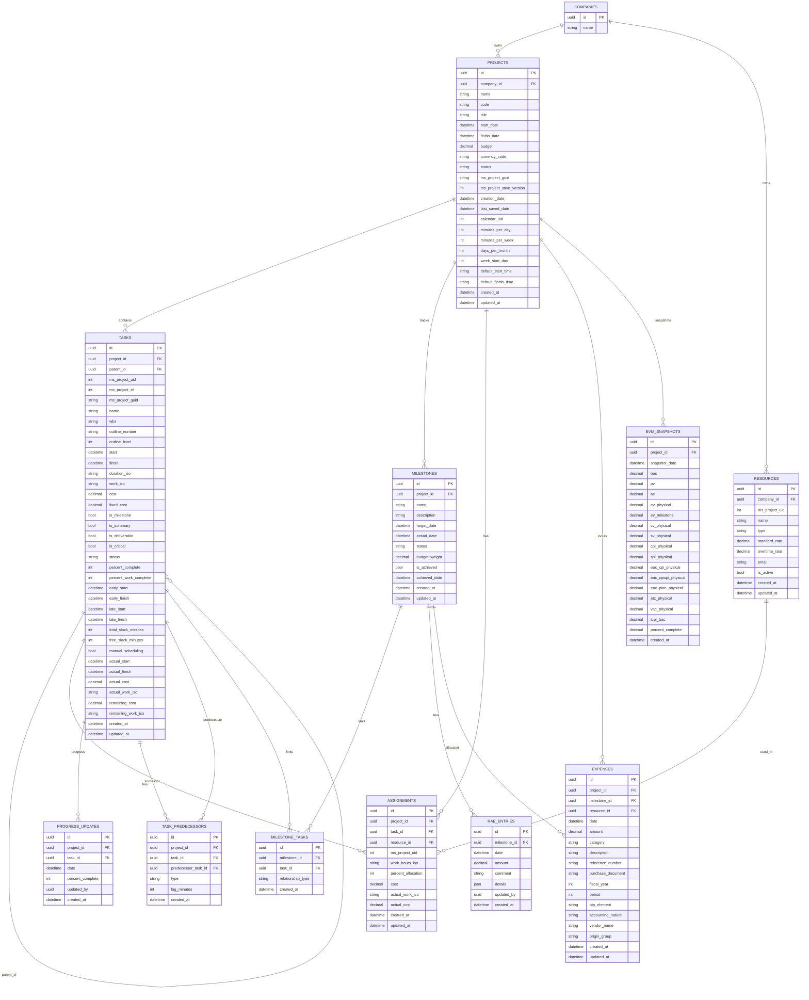
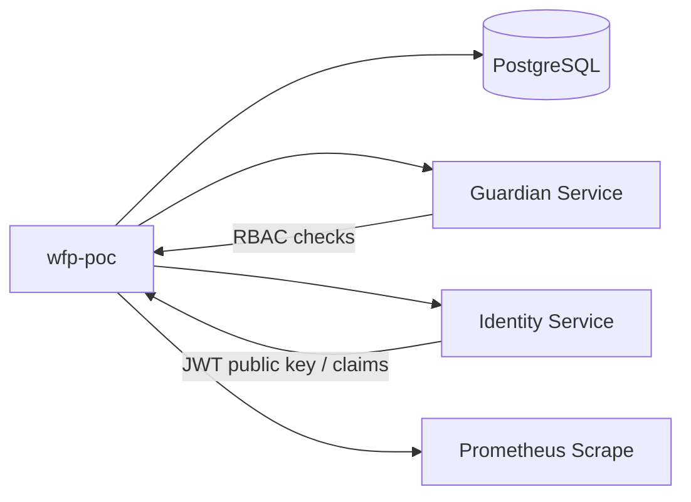

# wfp-poc Architecture Plan — Project Management & EVM API

Spec inputs:
- Specification: `spec/wfp-poc/schema-api-project-management-evm.md`
- OpenAPI source of truth: `openapi/wfp-poc-api-modular.yaml` (+ `openapi/paths/*.yaml`, `openapi/components/schemas/*.yaml`)

Service name (Guardian): `wfp-poc`
API versioning: OpenAPI uses `/{version}/...` with `version = v0` for current POC.

## Overview

The wfp-poc service provides:
- Project planning ingestion surface (projects, tasks, milestones, resources, assignments)
- Financial ingestion surface (expenses + bulk)
- Tracking updates (progress, RAE)
- Computation surfaces (EVM indicators, time-series, forecasts, statistics for charts)

Tenancy model:
- Tenant isolation is enforced by `company_id` from JWT claims.
- Project-scoped entities are partitioned by `project_id` (and transitively by `company_id`).
- Company-scoped entities (resources) are partitioned directly by `company_id`.

## Entity-Relationship Diagram (ERD)



Notes:
- “Deliverables” appear in the narrative spec, but they are not exposed as standalone OpenAPI paths in the modular OpenAPI. If deliverables are required as first-class API resources, add them to OpenAPI before implementing.

## Service Dependencies



Integration points:
- Identity/JWT:
  - Required claims: `user_id`, `company_id`, `email`
  - Token source: `access_token` cookie (Waterfall template)
- Guardian:
  - Permission checks per endpoint using operation mapping LIST/READ/CREATE/UPDATE/DELETE
  - Context fields: at least `company_id`, plus `{project_id, milestone_id, resource_id, task_id}` as relevant
- Database:
  - PostgreSQL recommended for constraints (unique indexes, optional exclusion constraints) and JSONB (`details` in RAE)

## Database Schema (DDL)

The DDL below is PostgreSQL-oriented (UUID + JSONB). For portability, keep using the project’s `GUID()` and `JSONB()` abstractions.

### 1) Core tenant-scoped tables

```sql
-- projects
CREATE TABLE projects (
  id UUID PRIMARY KEY DEFAULT gen_random_uuid(),
  company_id UUID NOT NULL,

  name VARCHAR(255) NOT NULL,
  code VARCHAR(50),
  title VARCHAR(255),

  start_date TIMESTAMPTZ NOT NULL,
  finish_date TIMESTAMPTZ NOT NULL,

  budget NUMERIC(15,2),
  currency_code CHAR(3) DEFAULT 'EUR',
  status VARCHAR(20) DEFAULT 'active',

  ms_project_guid VARCHAR(50),
  ms_project_save_version INTEGER,
  creation_date TIMESTAMPTZ,
  last_saved_date TIMESTAMPTZ,

  calendar_uid INTEGER,
  minutes_per_day INTEGER DEFAULT 420,
  minutes_per_week INTEGER DEFAULT 2100,
  days_per_month INTEGER DEFAULT 20,
  week_start_day INTEGER DEFAULT 1,
  default_start_time TIME DEFAULT '09:00:00',
  default_finish_time TIME DEFAULT '18:00:00',

  created_at TIMESTAMPTZ NOT NULL DEFAULT NOW(),
  updated_at TIMESTAMPTZ NOT NULL DEFAULT NOW(),

  CONSTRAINT ck_projects_dates CHECK (start_date < finish_date),
  CONSTRAINT uq_projects_company_code UNIQUE (company_id, code)
);

CREATE INDEX idx_projects_company_id ON projects(company_id);
CREATE INDEX idx_projects_company_status ON projects(company_id, status);
CREATE INDEX idx_projects_company_created_at ON projects(company_id, created_at DESC);
CREATE INDEX idx_projects_company_start_date ON projects(company_id, start_date);
```

```sql
-- tasks
CREATE TABLE tasks (
  id UUID PRIMARY KEY DEFAULT gen_random_uuid(),
  project_id UUID NOT NULL REFERENCES projects(id) ON DELETE CASCADE,
  parent_id UUID REFERENCES tasks(id) ON DELETE CASCADE,

  ms_project_uid INTEGER,
  ms_project_id INTEGER,
  ms_project_guid VARCHAR(50),

  name VARCHAR(255) NOT NULL,
  wbs VARCHAR(50),
  outline_number VARCHAR(50),
  outline_level INTEGER,

  start TIMESTAMPTZ NOT NULL,
  finish TIMESTAMPTZ NOT NULL,

  duration_iso VARCHAR(32),
  work_iso VARCHAR(32),

  cost NUMERIC(15,2),
  fixed_cost NUMERIC(15,2) DEFAULT 0,

  is_milestone BOOLEAN NOT NULL DEFAULT FALSE,
  is_summary BOOLEAN NOT NULL DEFAULT FALSE,
  is_deliverable BOOLEAN NOT NULL DEFAULT FALSE,
  is_critical BOOLEAN NOT NULL DEFAULT FALSE,

  status VARCHAR(20) NOT NULL DEFAULT 'not_started',
  percent_complete INTEGER NOT NULL DEFAULT 0,
  percent_work_complete INTEGER NOT NULL DEFAULT 0,

  early_start TIMESTAMPTZ,
  early_finish TIMESTAMPTZ,
  late_start TIMESTAMPTZ,
  late_finish TIMESTAMPTZ,
  total_slack_minutes INTEGER DEFAULT 0,
  free_slack_minutes INTEGER DEFAULT 0,
  manual_scheduling BOOLEAN NOT NULL DEFAULT FALSE,

  actual_start TIMESTAMPTZ,
  actual_finish TIMESTAMPTZ,
  actual_cost NUMERIC(15,2) DEFAULT 0,
  actual_work_iso VARCHAR(32),
  remaining_cost NUMERIC(15,2),
  remaining_work_iso VARCHAR(32),

  created_at TIMESTAMPTZ NOT NULL DEFAULT NOW(),
  updated_at TIMESTAMPTZ NOT NULL DEFAULT NOW(),

  CONSTRAINT ck_tasks_percent_complete CHECK (percent_complete BETWEEN 0 AND 100),
  CONSTRAINT ck_tasks_percent_work_complete CHECK (percent_work_complete BETWEEN 0 AND 100),
  CONSTRAINT ck_tasks_dates CHECK (start <= finish),
  CONSTRAINT uq_tasks_project_ms_project_uid UNIQUE (project_id, ms_project_uid)
);

CREATE INDEX idx_tasks_project_id ON tasks(project_id);
CREATE INDEX idx_tasks_project_parent_id ON tasks(project_id, parent_id);
CREATE INDEX idx_tasks_project_wbs ON tasks(project_id, wbs);
CREATE INDEX idx_tasks_project_is_milestone ON tasks(project_id, is_milestone);
CREATE INDEX idx_tasks_project_is_critical ON tasks(project_id, is_critical);
CREATE INDEX idx_tasks_project_status ON tasks(project_id, status);
CREATE INDEX idx_tasks_project_start ON tasks(project_id, start);
CREATE INDEX idx_tasks_project_finish ON tasks(project_id, finish);
```

```sql
-- task_predecessors (directed edges between tasks)
CREATE TABLE task_predecessors (
  id UUID PRIMARY KEY DEFAULT gen_random_uuid(),
  project_id UUID NOT NULL REFERENCES projects(id) ON DELETE CASCADE,
  task_id UUID NOT NULL REFERENCES tasks(id) ON DELETE CASCADE,
  predecessor_task_id UUID NOT NULL REFERENCES tasks(id) ON DELETE CASCADE,
  type VARCHAR(2) NOT NULL, -- FS|SS|FF|SF
  lag_minutes INTEGER NOT NULL DEFAULT 0,
  created_at TIMESTAMPTZ NOT NULL DEFAULT NOW(),

  CONSTRAINT ck_task_pred_type CHECK (type IN ('FS','SS','FF','SF')),
  CONSTRAINT ck_task_pred_not_self CHECK (task_id <> predecessor_task_id),
  CONSTRAINT uq_task_pred UNIQUE (task_id, predecessor_task_id)
);

CREATE INDEX idx_task_pred_task_id ON task_predecessors(task_id);
CREATE INDEX idx_task_pred_predecessor_task_id ON task_predecessors(predecessor_task_id);
CREATE INDEX idx_task_pred_project_id ON task_predecessors(project_id);
```

### 2) Milestones & tracking

```sql
-- milestones
CREATE TABLE milestones (
  id UUID PRIMARY KEY DEFAULT gen_random_uuid(),
  project_id UUID NOT NULL REFERENCES projects(id) ON DELETE CASCADE,

  name VARCHAR(255) NOT NULL,
  description VARCHAR(1000),

  target_date TIMESTAMPTZ NOT NULL,
  actual_date TIMESTAMPTZ,
  status VARCHAR(20) NOT NULL DEFAULT 'upcoming',

  budget_weight NUMERIC(6,4) NOT NULL,
  is_achieved BOOLEAN NOT NULL DEFAULT FALSE,
  achieved_date TIMESTAMPTZ,

  created_at TIMESTAMPTZ NOT NULL DEFAULT NOW(),
  updated_at TIMESTAMPTZ NOT NULL DEFAULT NOW(),

  CONSTRAINT ck_milestones_status CHECK (status IN ('upcoming','achieved','missed')),
  CONSTRAINT ck_milestones_weight CHECK (budget_weight >= 0 AND budget_weight <= 1)
);

CREATE INDEX idx_milestones_project_id ON milestones(project_id);
CREATE INDEX idx_milestones_project_target_date ON milestones(project_id, target_date);
CREATE INDEX idx_milestones_project_status ON milestones(project_id, status);

-- NOTE: "sum(budget_weight)=1.0" is best enforced at application level.
-- For stronger enforcement, implement a trigger that validates the sum per project.
```

```sql
-- milestone_tasks (M:N)
CREATE TABLE milestone_tasks (
  id UUID PRIMARY KEY DEFAULT gen_random_uuid(),
  milestone_id UUID NOT NULL REFERENCES milestones(id) ON DELETE CASCADE,
  task_id UUID NOT NULL REFERENCES tasks(id) ON DELETE CASCADE,
  relationship_type VARCHAR(20) NOT NULL DEFAULT 'predecessor',
  created_at TIMESTAMPTZ NOT NULL DEFAULT NOW(),

  CONSTRAINT uq_milestone_task UNIQUE (milestone_id, task_id)
);

CREATE INDEX idx_milestone_tasks_milestone_id ON milestone_tasks(milestone_id);
CREATE INDEX idx_milestone_tasks_task_id ON milestone_tasks(task_id);
```

```sql
-- RAE entries (history)
CREATE TABLE rae_entries (
  id UUID PRIMARY KEY DEFAULT gen_random_uuid(),
  milestone_id UUID NOT NULL REFERENCES milestones(id) ON DELETE CASCADE,
  date TIMESTAMPTZ NOT NULL,
  amount NUMERIC(15,2) NOT NULL,
  comment VARCHAR(500),
  details JSONB,
  updated_by UUID NOT NULL,
  created_at TIMESTAMPTZ NOT NULL DEFAULT NOW(),

  CONSTRAINT ck_rae_amount CHECK (amount >= 0),
  CONSTRAINT uq_rae_milestone_date UNIQUE (milestone_id, date)
);

CREATE INDEX idx_rae_milestone_date ON rae_entries(milestone_id, date DESC);
```

```sql
-- progress updates (history)
CREATE TABLE progress_updates (
  id UUID PRIMARY KEY DEFAULT gen_random_uuid(),
  project_id UUID NOT NULL REFERENCES projects(id) ON DELETE CASCADE,
  task_id UUID NOT NULL REFERENCES tasks(id) ON DELETE CASCADE,
  date TIMESTAMPTZ NOT NULL,
  percent_complete INTEGER NOT NULL,
  updated_by UUID NOT NULL,
  created_at TIMESTAMPTZ NOT NULL DEFAULT NOW(),

  CONSTRAINT ck_progress_percent_complete CHECK (percent_complete BETWEEN 0 AND 100)
);

CREATE INDEX idx_progress_project_date ON progress_updates(project_id, date DESC);
CREATE INDEX idx_progress_task_date ON progress_updates(task_id, date DESC);
```

### 3) Company-scoped resources and project-scoped assignments

```sql
-- resources (company-scoped)
CREATE TABLE resources (
  id UUID PRIMARY KEY DEFAULT gen_random_uuid(),
  company_id UUID NOT NULL,

  ms_project_uid INTEGER,
  name VARCHAR(255) NOT NULL,
  type VARCHAR(20) NOT NULL DEFAULT 'labor',
  standard_rate NUMERIC(15,2) DEFAULT 0,
  overtime_rate NUMERIC(15,2) DEFAULT 0,
  email VARCHAR(255),
  is_active BOOLEAN NOT NULL DEFAULT TRUE,

  created_at TIMESTAMPTZ NOT NULL DEFAULT NOW(),
  updated_at TIMESTAMPTZ NOT NULL DEFAULT NOW(),

  CONSTRAINT ck_resource_type CHECK (type IN ('labor','material','cost')),
  CONSTRAINT ck_resource_standard_rate CHECK (standard_rate >= 0),
  CONSTRAINT ck_resource_overtime_rate CHECK (overtime_rate >= 0)
);

CREATE INDEX idx_resources_company_id ON resources(company_id);
CREATE INDEX idx_resources_company_active ON resources(company_id, is_active);
CREATE INDEX idx_resources_company_type ON resources(company_id, type);
```

```sql
-- assignments
CREATE TABLE assignments (
  id UUID PRIMARY KEY DEFAULT gen_random_uuid(),
  project_id UUID NOT NULL REFERENCES projects(id) ON DELETE CASCADE,
  task_id UUID NOT NULL REFERENCES tasks(id) ON DELETE CASCADE,
  resource_id UUID NOT NULL REFERENCES resources(id),

  ms_project_uid INTEGER,
  work_hours_iso VARCHAR(32),
  percent_allocation INTEGER NOT NULL DEFAULT 100,
  cost NUMERIC(15,2),
  actual_work_iso VARCHAR(32),
  actual_cost NUMERIC(15,2) DEFAULT 0,

  created_at TIMESTAMPTZ NOT NULL DEFAULT NOW(),
  updated_at TIMESTAMPTZ NOT NULL DEFAULT NOW(),

  CONSTRAINT ck_assignment_percent_allocation CHECK (percent_allocation BETWEEN 0 AND 100),
  CONSTRAINT uq_assignment_task_resource UNIQUE (task_id, resource_id)
);

CREATE INDEX idx_assignments_project_id ON assignments(project_id);
CREATE INDEX idx_assignments_task_id ON assignments(task_id);
CREATE INDEX idx_assignments_resource_id ON assignments(resource_id);
```

### 4) Expenses & EVM snapshots

```sql
-- expenses
CREATE TABLE expenses (
  id UUID PRIMARY KEY DEFAULT gen_random_uuid(),
  project_id UUID NOT NULL REFERENCES projects(id) ON DELETE CASCADE,
  milestone_id UUID REFERENCES milestones(id),
  resource_id UUID REFERENCES resources(id),

  date TIMESTAMPTZ NOT NULL,
  amount NUMERIC(15,2) NOT NULL,
  category VARCHAR(20) NOT NULL,
  description VARCHAR(500),

  reference_number VARCHAR(50),
  purchase_document VARCHAR(50),
  fiscal_year INTEGER,
  period INTEGER,
  otp_element VARCHAR(50),
  accounting_nature VARCHAR(50),
  vendor_name VARCHAR(255),
  origin_group VARCHAR(50),

  created_at TIMESTAMPTZ NOT NULL DEFAULT NOW(),
  updated_at TIMESTAMPTZ NOT NULL DEFAULT NOW(),

  CONSTRAINT ck_expenses_amount CHECK (amount >= 0),
  CONSTRAINT ck_expenses_category CHECK (category IN ('labor','procurement','subcontracting','overhead') )
);

-- Uniqueness to avoid duplicate ERP imports (spec guidance)
CREATE UNIQUE INDEX uq_expenses_import_dedupe
  ON expenses(project_id, reference_number, date, amount)
  WHERE reference_number IS NOT NULL;

CREATE INDEX idx_expenses_project_date ON expenses(project_id, date);
CREATE INDEX idx_expenses_project_category ON expenses(project_id, category);
CREATE INDEX idx_expenses_project_milestone ON expenses(project_id, milestone_id);
```

```sql
-- evm_snapshots (optional but recommended for fast timeseries)
CREATE TABLE evm_snapshots (
  id UUID PRIMARY KEY DEFAULT gen_random_uuid(),
  project_id UUID NOT NULL REFERENCES projects(id) ON DELETE CASCADE,
  snapshot_date TIMESTAMPTZ NOT NULL,

  bac NUMERIC(15,2) NOT NULL,
  pv NUMERIC(15,2) NOT NULL,
  ac NUMERIC(15,2) NOT NULL,
  ev_physical NUMERIC(15,2) NOT NULL,
  ev_milestone NUMERIC(15,2) NOT NULL,

  cv_physical NUMERIC(15,2),
  sv_physical NUMERIC(15,2),
  cpi_physical NUMERIC(15,4),
  spi_physical NUMERIC(15,4),

  eac_cpi_physical NUMERIC(15,2),
  eac_cpispi_physical NUMERIC(15,2),
  eac_plan_physical NUMERIC(15,2),
  etc_physical NUMERIC(15,2),
  vac_physical NUMERIC(15,2),
  tcpi_bac NUMERIC(15,4),
  percent_complete NUMERIC(6,2),

  created_at TIMESTAMPTZ NOT NULL DEFAULT NOW(),

  CONSTRAINT uq_evm_snapshot UNIQUE (project_id, snapshot_date)
);

CREATE INDEX idx_evm_project_snapshot_date ON evm_snapshots(project_id, snapshot_date DESC);
```

## Endpoint Inventory (OpenAPI)

The OpenAPI surface (source of truth) is:
- Non-versioned: `/health`, `/ready`, `/version`, `/metrics`
- Versioned: `/{version}/...` (use `v0`)

Versioned groups:
- Projects: `/{version}/projects`, `/{version}/projects/{id}`
- Tasks: `/{version}/projects/{project_id}/tasks` (+ `/bulk`, `/sync`, `/{id}`)
- Milestones: `/{version}/projects/{project_id}/milestones` (+ `/{id}`) and milestone-task linking endpoints
- Resources: `/{version}/resources` (+ `/{id}`)
- Assignments: `/{version}/projects/{project_id}/assignments` (+ `/{id}`)
- Expenses: `/{version}/projects/{project_id}/expenses` (+ `/bulk`, `/{id}`)
- Progress: `/{version}/projects/{project_id}/progress` (+ `/history`)
- RAE: `/{version}/milestones/{milestone_id}/rae` (+ `/history`), plus `/{version}/projects/{project_id}/rae/summary`
- EVM: `/{version}/projects/{project_id}/evm` (+ `/timeseries`, `/forecasts`)
- Statistics: 3 endpoints for chart series

## Guardian Permissions (proposed)

Operation mapping:
- GET collection → LIST
- GET single → READ
- POST → CREATE
- PUT/PATCH → UPDATE
- DELETE → DELETE

Proposed Guardian resource map:

```json
{
  "service": "wfp-poc",
  "resources": [
    {"name": "projects", "operations": ["LIST","CREATE","READ","UPDATE","DELETE"], "context_fields": ["company_id"], "description": "Project CRUD"},
    {"name": "tasks", "operations": ["LIST","CREATE","READ","UPDATE","DELETE"], "context_fields": ["company_id","project_id"], "description": "Task CRUD + bulk/sync"},
    {"name": "milestones", "operations": ["LIST","CREATE","READ","UPDATE","DELETE"], "context_fields": ["company_id","project_id"], "description": "Milestone CRUD + milestone-task links"},
    {"name": "resources", "operations": ["LIST","CREATE","READ","UPDATE","DELETE"], "context_fields": ["company_id"], "description": "Company-scoped resources"},
    {"name": "assignments", "operations": ["LIST","CREATE","READ","UPDATE","DELETE"], "context_fields": ["company_id","project_id"], "description": "Task-resource assignments"},
    {"name": "expenses", "operations": ["LIST","CREATE","READ","UPDATE","DELETE"], "context_fields": ["company_id","project_id"], "description": "Expenses + bulk import"},
    {"name": "progress", "operations": ["CREATE","READ"], "context_fields": ["company_id","project_id"], "description": "Progress updates + history"},
    {"name": "rae", "operations": ["CREATE","READ"], "context_fields": ["company_id","project_id","milestone_id"], "description": "RAE updates + history + summary"},
    {"name": "evm", "operations": ["READ"], "context_fields": ["company_id","project_id"], "description": "EVM calculations"},
    {"name": "statistics", "operations": ["READ"], "context_fields": ["company_id","project_id"], "description": "Chart-ready aggregates"}
  ]
}
```

## Implementation Plan (vertical slices by endpoint)

Guiding principle: each slice includes resource (HTTP), schema (validation), model/migration (if first), and tests.

### Phase 1 — Foundation (M1-Foundation)
- DB migration(s) creating all tables above (projects, tasks, task_predecessors, milestones, milestone_tasks, resources, assignments, expenses, rae_entries, progress_updates, evm_snapshots)
- Shared constants for resource names + operations
- Common utilities:
  - tenant scoping helper (company_id)
  - pagination helpers (page/per_page)
  - correlation-id propagation

Estimate: 5–8 points (1–2 days)

### Phase 2 — Core CRUD & imports (M2-CRUD)

Projects
- GET `/{version}/projects` (5 pts, medium): list + filters + pagination
- POST `/{version}/projects` (5 pts, medium): create + unique code per company
- GET `/{version}/projects/{id}` (3 pts, low)
- PATCH `/{version}/projects/{id}` (5 pts, medium)
- DELETE `/{version}/projects/{id}` (3 pts, low): enforce 409 when related data exists

Tasks
- GET `/{version}/projects/{project_id}/tasks` (5 pts, medium): filters parent/is_milestone/is_critical, sorting
- POST `/{version}/projects/{project_id}/tasks` (5 pts, medium)
- GET `/{version}/projects/{project_id}/tasks/{id}` (3 pts, low)
- PATCH `/{version}/projects/{project_id}/tasks/{id}` (5 pts, medium): validate dates, predecessors cycle check
- DELETE `/{version}/projects/{project_id}/tasks/{id}` (3 pts, medium): handle predecessor references
- POST `/{version}/projects/{project_id}/tasks/bulk` (8 pts, high): transactional bulk create + per-item errors
- PUT `/{version}/projects/{project_id}/tasks/sync` (8 pts, high): upsert planning fields + preserve tracking fields

Milestones
- GET `/{version}/projects/{project_id}/milestones` (5 pts, medium)
- POST `/{version}/projects/{project_id}/milestones` (5 pts, medium): enforce budget_weight sum <= 1.0
- GET `/{version}/projects/{project_id}/milestones/{id}` (3 pts, low)
- PATCH `/{version}/projects/{project_id}/milestones/{id}` (5 pts, medium)
- DELETE `/{version}/projects/{project_id}/milestones/{id}` (3 pts, medium): enforce 409 on linked expenses
- POST `/{version}/milestones/{milestone_id}/tasks` (5 pts, medium): link tasks + recalc target_date
- PUT `/{version}/milestones/{milestone_id}/tasks/sync` (5 pts, medium): replace link set + recalc
- GET `/{version}/milestones/{milestone_id}/tasks` (3 pts, low)

Resources (company-scoped)
- GET `/{version}/resources` (5 pts, medium): filters + pagination
- POST `/{version}/resources` (5 pts, medium)
- GET `/{version}/resources/{id}` (3 pts, low)
- PATCH `/{version}/resources/{id}` (5 pts, medium)
- DELETE `/{version}/resources/{id}` (3 pts, medium): enforce 409 when assigned

Assignments
- GET `/{version}/projects/{project_id}/assignments` (5 pts, medium)
- POST `/{version}/projects/{project_id}/assignments` (5 pts, medium): enforce uq(task_id, resource_id)
- GET `/{version}/projects/{project_id}/assignments/{id}` (3 pts, low)
- PATCH `/{version}/projects/{project_id}/assignments/{id}` (5 pts, medium)
- DELETE `/{version}/projects/{project_id}/assignments/{id}` (3 pts, low)

Expenses
- GET `/{version}/projects/{project_id}/expenses` (5 pts, medium): filters + pagination
- POST `/{version}/projects/{project_id}/expenses` (5 pts, medium): allocate milestone_id from date
- GET `/{version}/projects/{project_id}/expenses/{id}` (3 pts, low)
- POST `/{version}/projects/{project_id}/expenses/bulk` (8 pts, high): transactional bulk + dedupe
- PATCH/DELETE for expenses are not currently exposed by OpenAPI modular file; implement only if present in OpenAPI.

Estimate: ~120–150 points total if implemented as-is (multi-sprint). For POC MVP, prioritize Projects + Tasks + Milestones + Expenses(bulk) + EVM.

### Phase 3 — Calculations & reporting (M3-Calc)

Progress
- POST `/{version}/projects/{project_id}/progress` (5 pts, medium): write progress_updates + update tasks.status
- GET `/{version}/projects/{project_id}/progress/history` (5 pts, medium): paginate history

RAE
- POST `/{version}/milestones/{milestone_id}/rae` (5 pts, medium)
- GET `/{version}/milestones/{milestone_id}/rae/history` (5 pts, medium)
- GET `/{version}/projects/{project_id}/rae/summary` (5 pts, medium)

EVM
- GET `/{version}/projects/{project_id}/evm` (8 pts, high): compute PV/AC/EV methods + indices + null-on-zero rules
- GET `/{version}/projects/{project_id}/evm/timeseries` (8 pts, high): use evm_snapshots or compute by month
- GET `/{version}/projects/{project_id}/evm/forecasts` (8 pts, high): CPI, CPI×SPI, plan-based projections

Statistics
- GET `/{version}/projects/{project_id}/statistics/expenses/by-category` (5 pts, medium)
- GET `/{version}/projects/{project_id}/statistics/labor/by-resource` (5 pts, medium)
- GET `/{version}/projects/{project_id}/statistics/expenses/monthly` (5 pts, medium)

Estimate: ~60–80 points.

### Phase 4 — Quality & hardening (M4-Quality)
- Performance hardening: indexes, query plans, response times on list endpoints
- Input validation edge-cases: UUID parsing, ISO8601 handling, duration parsing/normalization
- Consistency checks:
  - predecessor cycle detection algorithm (topological sort)
  - milestone target_date recalculation correctness
  - expense-to-milestone allocation rules
- OpenAPI contract tests: ensure implementation matches OpenAPI responses

Estimate: 13–21 points.

## Performance Optimization Strategy

Baseline (POC): correctness first, optimize only where it helps developer experience.

High-value optimizations:
- Indexes (already listed in DDL):
  - `projects(company_id, created_at)`
  - `tasks(project_id, parent_id)`, `tasks(project_id, wbs)`
  - `expenses(project_id, date)`, `expenses(project_id, category)`
  - `evm_snapshots(project_id, snapshot_date)`
- Pagination defaults: `per_page=20`, cap at `100`.
- Avoid N+1:
  - When returning tasks with predecessor arrays, fetch predecessor edges in one query.
- EVM endpoints:
  - Prefer reading from `evm_snapshots` for timeseries if snapshot persistence is enabled.
  - If computing on-demand, cache intermediate monthly aggregates per request (in-memory).
- Rate limiting (per spec guidance):
  - bulk endpoints: ~10/min/user
  - standard CRUD: ~100/min/user
  - EVM calc: ~20/min/user

## Risks & Mitigations

- Task dependency cycles (high risk):
  - Mitigation: validate predecessor edges with topological sort on create/update/bulk/sync.
- Milestone budget_weight sum and non-overlap (medium risk):
  - Mitigation: enforce in service layer transactionally; optionally add triggers.
- Expense allocation correctness (medium risk):
  - Mitigation: define deterministic ordering of milestones by target_date; explicit validation for out-of-range expenses.
- EVM computation correctness (high risk):
  - Mitigation: build a deterministic test corpus (small project) and assert PV/AC/EV outputs.

## Estimation Summary

- Total scope (full OpenAPI surface): ~200–250 points
- MVP recommendation (POC): Projects + Tasks (CRUD + bulk/sync) + Milestones (CRUD + linking) + Expenses (bulk) + EVM (project + timeseries)
- MVP estimate: ~80–110 points (2–3 sprints for 1 developer)
