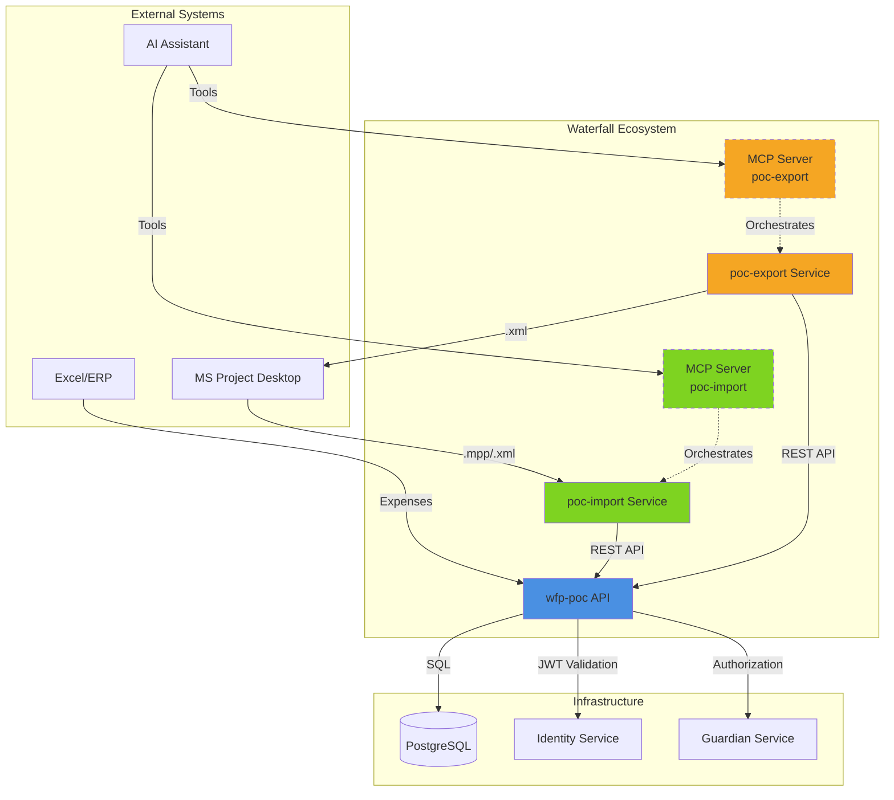
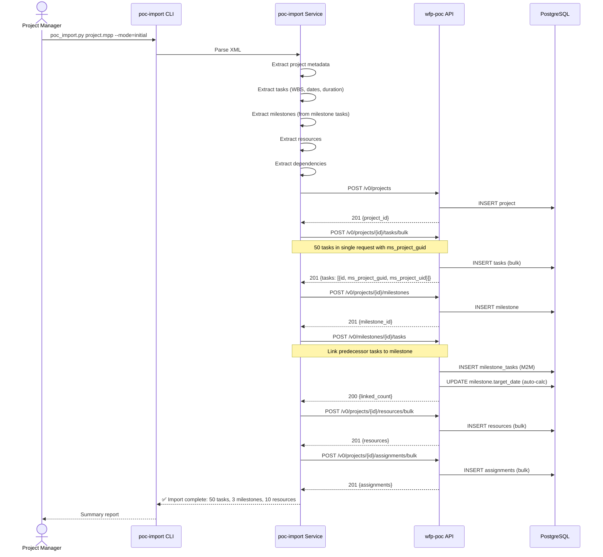
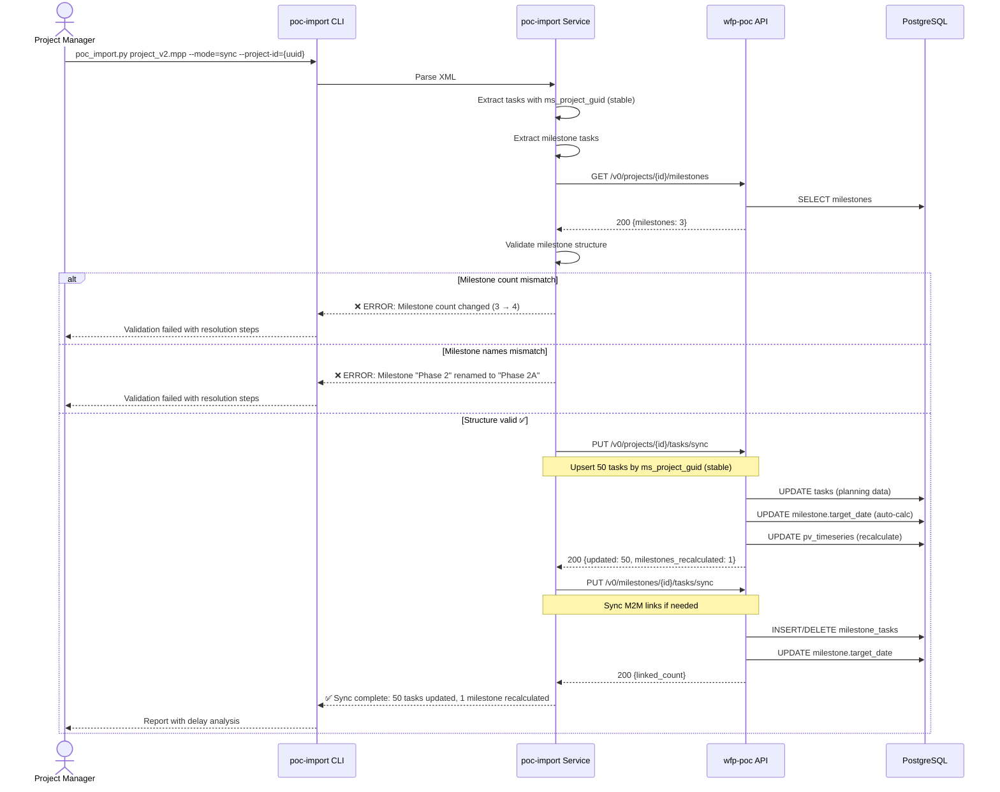
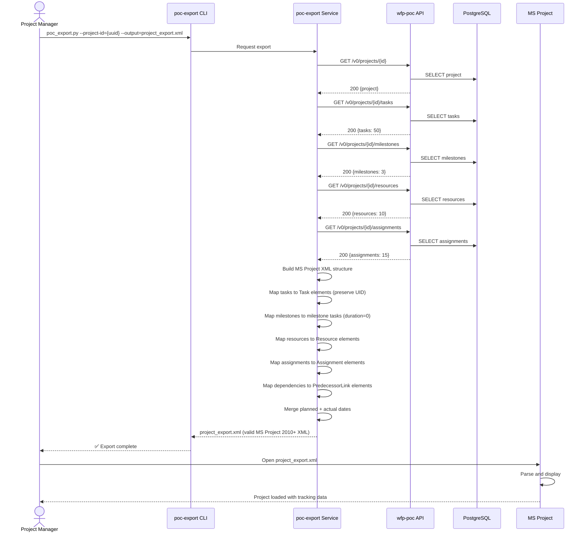
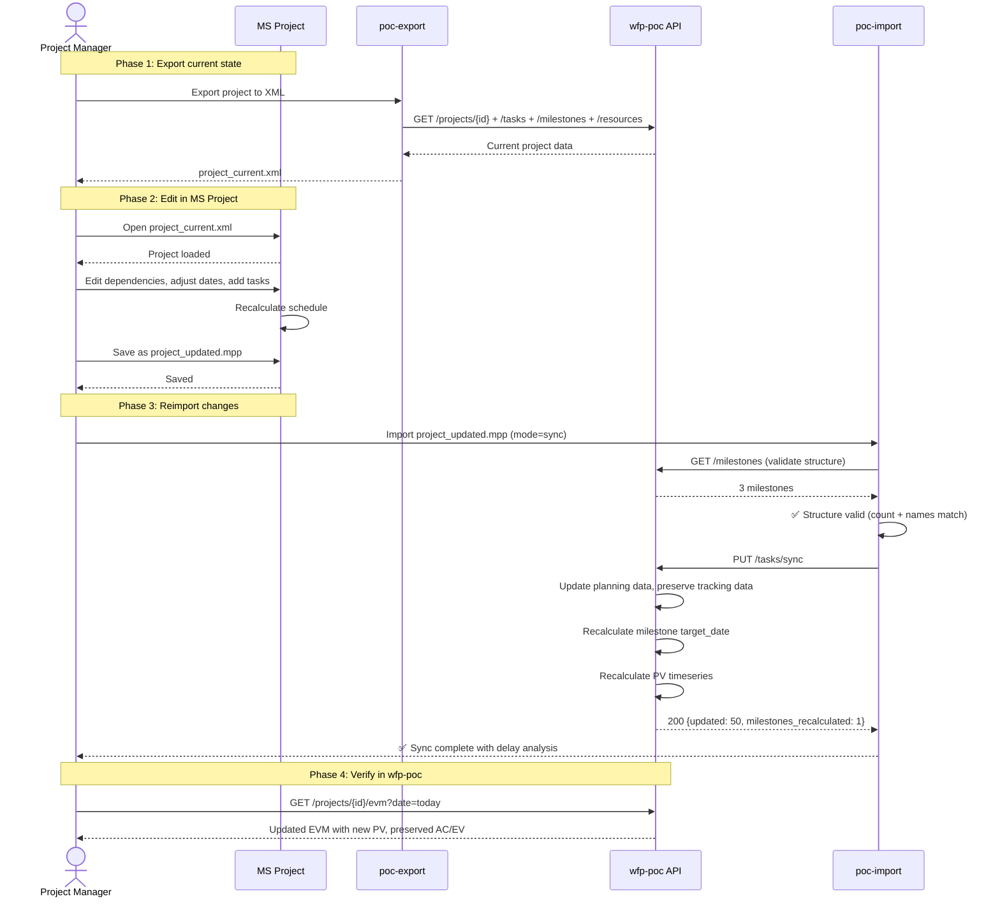

<p align="center">
  
</p>

# Integration Specification - Waterfall Project Management Services

## 1. Purpose & Scope

This specification defines the integration architecture, communication protocols, and workflows for the Waterfall Project Management ecosystem, consisting of three services:

- **wfp-poc**: REST API service providing project management, EVM calculations, and data persistence
- **poc-import**: MS Project import service validating and transforming MS Project XML into wfp-poc API calls
- **poc-export**: Export service generating MS Project XML from wfp-poc data for round-trip compatibility

**Intended Audience**: Developers, architects, and integrators working on the Waterfall ecosystem.

**Assumptions**:
- All services authenticate via JWT tokens (Identity service)
- MS Project 2010+ XML format is the exchange standard
- wfp-poc is the system of record for tracking data (AC, EV, RAE, expenses)
- MS Project is the system of record for planning data (WBS, tasks, dependencies, dates)

## 2. Definitions

| Term | Definition |
|------|------------|
| **wfp-poc** | Waterfall POC - Core REST API service managing projects, tasks, milestones, resources, expenses, EVM |
| **poc-import** | MS Project Import Service - Validates and transforms .mpp/.xml files into wfp-poc API calls |
| **poc-export** | MS Project Export Service - Generates MS Project XML from wfp-poc data preserving UIDs/GUIDs |
| **Initial Import** | First-time import creating all entities (project, tasks, milestones, resources) |
| **Reimport** | Subsequent import updating planning data while preserving tracking data |
| **Round-Trip** | Full cycle: wfp-poc → Export → MS Project edits → Reimport → wfp-poc |
| **Structural Validation** | Verification that milestone count and names remain unchanged during reimport |
| **Planning Data** | MS Project-sourced data: WBS, task dates, durations, dependencies, resource assignments |
| **Tracking Data** | wfp-poc-sourced data: expenses, actual dates, progress, RAE, EV calculations |
| **ms_project_uid** | MS Project Task UID - integer ID displayed in MS Project (unstable, changes on reorder) |
| **ms_project_guid** | MS Project Task GUID - UUID stable identifier for task-level upsert reconciliation |
| **ms_project_project_guid** | MS Project Project GUID - UUID for project-level identification |
| **MCP Server** | Model Context Protocol Server - AI-accessible interface to services |

## 3. Requirements, Constraints & Guidelines

### Integration Requirements (INT-xxx)

#### Service Communication

- **INT-001**: poc-import SHALL communicate with wfp-poc via REST API over HTTP/HTTPS
- **INT-002**: poc-export SHALL communicate with wfp-poc via REST API over HTTP/HTTPS
- **INT-003**: All API requests SHALL include valid JWT token in Authorization header
- **INT-004**: API endpoints SHALL return standard HTTP status codes (200, 201, 400, 401, 403, 404, 409, 500)
- **INT-005**: Error responses SHALL include `correlation_id` for request tracing across services

#### MS Project Compatibility

- **INT-006**: poc-import SHALL parse MS Project 2010+ XML format
- **INT-007**: poc-import SHALL preserve `ms_project_guid` (Task GUID) for upsert reconciliation
- **INT-008**: poc-import SHALL preserve `ms_project_uid` (Task UID) for display/reference purposes only
- **INT-009**: poc-import SHALL preserve `ms_project_project_guid` (Project GUID) for project identification
- **INT-010**: poc-export SHALL generate valid MS Project 2010+ XML compatible with MS Project desktop
- **INT-011**: poc-export SHALL preserve GUID/UID mappings for round-trip consistency

#### Import Validation

- **INT-012**: poc-import SHALL validate milestone structure consistency on reimport (count + names)
- **INT-013**: poc-import SHALL reject reimport if milestone count changed from previous import
- **INT-014**: poc-import SHALL reject reimport if milestone names changed from previous import
- **INT-015**: poc-import SHALL allow reimport if only task dates, durations, or dependencies changed
- **INT-016**: poc-import SHALL provide detailed validation error messages with resolution steps

#### Data Synchronization

- **INT-017**: Initial import SHALL create all entities: project, tasks, milestones, resources
- **INT-018**: Reimport SHALL use PUT /tasks/sync endpoint for upsert based on `ms_project_guid`
- **INT-019**: Reimport SHALL preserve tracking data (actual_start_date, actual_finish_date, percent_complete)
- **INT-020**: Reimport SHALL update planning data (planned_start_date, planned_finish_date, duration, predecessors)
- **INT-021**: wfp-poc SHALL auto-recalculate milestone target_date when predecessor task dates change

#### Export Requirements

- **INT-022**: poc-export SHALL export current project state including all tasks, milestones, resources
- **INT-023**: poc-export SHALL map wfp-poc tasks to MS Project Task elements with preserved GUIDs/UIDs
- **INT-024**: poc-export SHALL export actual dates to MS Project ActualStart/ActualFinish fields
- **INT-025**: poc-export SHALL export planned dates to MS Project Start/Finish fields
- **INT-026**: poc-export SHALL export dependencies as MS Project PredecessorLink elements

#### MCP Server Requirements

- **INT-027**: poc-import MAY expose MCP server for AI-assisted import workflows
- **INT-028**: poc-export MAY expose MCP server for AI-assisted export workflows
- **INT-029**: MCP servers SHALL support tools for file upload, validation, and API orchestration
- **INT-030**: MCP servers SHALL return structured JSON responses compatible with AI tools

### Performance Constraints (CON-xxx)

- **CON-001**: poc-import SHALL process projects with up to 10,000 tasks within 60 seconds
- **CON-002**: poc-export SHALL generate XML for projects with up to 10,000 tasks within 30 seconds
- **CON-003**: Bulk task creation (POST /tasks/bulk) SHALL support up to 1,000 tasks per request
- **CON-004**: Task sync (PUT /tasks/sync) SHALL support up to 1,000 tasks per request

### Security Constraints (CON-xxx)

- **CON-005**: poc-import SHALL NOT store JWT tokens in logs or temporary files
- **CON-006**: poc-export SHALL NOT expose PII in generated XML without authorization
- **CON-007**: File uploads SHALL be limited to 50 MB per request

### Guidelines (GUD-xxx)

- **GUD-001**: Use `ms_project_guid` for task-level reconciliation (upsert) - GUID is stable across reorders
- **GUD-002**: Use `ms_project_project_guid` for project-level identification
- **GUD-003**: Preserve `ms_project_uid` for display/traceability but DO NOT use for upsert (unstable)
- **GUD-004**: Prefer bulk endpoints (POST /tasks/bulk, PUT /tasks/sync) over individual creates/updates
- **GUD-005**: Export planning data from wfp-poc to MS Project for reporting, not for editing
- **GUD-006**: Use MS Project for initial structure definition, wfp-poc for tracking and EVM

## 4. Service Architecture

### Component Diagram



### Service Responsibilities

| Service | Responsibilities | Technology |
|---------|------------------|------------|
| **wfp-poc** | - Project/task/milestone CRUD<br/>- EVM calculations<br/>- Expense tracking<br/>- RAE management<br/>- Data persistence | Flask, SQLAlchemy, PostgreSQL |
| **poc-import** | - MS Project XML parsing<br/>- Structural validation<br/>- API orchestration<br/>- Error handling & rollback | Python, lxml, requests |
| **poc-export** | - wfp-poc data retrieval<br/>- MS Project XML generation<br/>- UID/GUID preservation<br/>- Round-trip compatibility | Python, lxml, requests |

## 5. Use Cases & Workflows

### Use Case 1: Initial Import - First Time Setup

**Actors**: Project Manager, poc-import service, wfp-poc API

**Preconditions**: 
- MS Project file exists with complete WBS, tasks, dependencies, resources
- User has valid JWT token with CREATE permissions

**Sequence Diagram**:



**Postconditions**:
- Project created with `ms_project_project_guid`
- All tasks created with `ms_project_guid` (stable) and `ms_project_uid` (display only) preserved
- Milestones created with M2M links to predecessor tasks
- Resources and assignments created
- `target_date` auto-calculated for all milestones

**Example**:

```bash
# Initial import command
python poc_import.py /path/to/project.mpp \
  --mode=initial \
  --api-url=http://wfp-poc:5000/v0 \
  --token=$JWT_TOKEN

# Output:
# Parsing project.mpp...
# Extracted: 1 project, 50 tasks, 3 milestones, 10 resources
# Creating project "Infrastructure Upgrade"...
# ✅ Project created (ID: 123e4567-e89b-12d3-a456-426614174000)
# Bulk creating 50 tasks...
# ✅ 50 tasks created
# Creating 3 milestones...
# ✅ Milestone "Phase 1 Complete" created, linked to 3 tasks
# ✅ Milestone "Phase 2 Complete" created, linked to 5 tasks
# ✅ Milestone "Phase 3 Complete" created, linked to 7 tasks
# Creating 10 resources...
# ✅ 10 resources created
# Creating 15 assignments...
# ✅ 15 assignments created
#
# 🎉 Import complete!
# Project ID: 123e4567-e89b-12d3-a456-426614174000
# Tasks: 50 (3 summary, 44 normal, 3 milestone)
# Milestones: 3
# Resources: 10
# Assignments: 15
```

---

### Use Case 2: Reimport - Sync Planning Changes

**Actors**: Project Manager, poc-import service, wfp-poc API

**Preconditions**:
- Project already imported with initial structure
- MS Project file updated with new dates/dependencies
- Milestone count and names unchanged
- User has valid JWT token with UPDATE permissions

**Sequence Diagram**:



**Postconditions**:
- Planning data updated (planned_start_date, planned_finish_date, duration, predecessors)
- Tracking data preserved (actual dates, percent_complete, RAE)
- Milestones auto-recalculated with critical task identification
- PV timeseries recalculated with new dates

**Example**: *(Moved from wfp-poc spec Example 3)*

#### Phase 1: Initial Import (First Time)

**Step 1: poc-import validates and parses MS Project XML**
```bash
# poc-import service receives project.mpp
python poc_import.py project.mpp --mode=initial --api-url=http://wfp-poc:5000/v0

# Extracts:
# - Project metadata
# - 50 tasks (including 3 milestone tasks with duration=0)
# - 3 milestones derived from milestone tasks
# - Task dependencies (predecessor graph)
# - 10 resources
```

**Step 2: Create project**
```http
POST /v0/projects
{
  "name": "Infrastructure Upgrade",
  "planned_start_date": "2026-03-01",
  "planned_finish_date": "2026-08-31",
  "budget": 500000,
  "ms_project_guid": "GUID-123-ABC"
}
```

**Step 3: Bulk create tasks**
```http
POST /v0/projects/{project_id}/tasks/bulk
{
  "tasks": [
    {
      "ms_project_guid": "41DA3870-5DF4-EF11-9360-F4EE08B24B68",
      "ms_project_uid": 1,
      "name": "Planning Phase",
      "type": "summary",
      "wbs_code": "1",
      ...
    },
    {
      "ms_project_guid": "42DA3870-5DF4-EF11-9360-F4EE08B24B68",
      "ms_project_uid": 10,
      "name": "Phase 1 Complete",
      "type": "milestone",
      "duration": 0,
      "planned_finish_date": "2026-04-30T00:00:00Z"
    },
    ...
  ]
}
```

**Step 4: Create milestones (EVM entities) with M2M links**
```http
POST /v0/projects/{project_id}/milestones
{
  "name": "Phase 1 Complete",
  "target_date": "2026-04-30T00:00:00Z",  # Initially from milestone task
  "budget_weight": 0.33
}

# Response: {"data": {"id": "milestone-uuid-1", ...}}

# Link predecessor tasks to milestone
POST /v0/milestones/milestone-uuid-1/tasks
{
  "task_ids": ["task-uuid-5", "task-uuid-7", "task-uuid-10"]  # Tasks preceding this milestone
}

# System automatically calculates:
# target_date = MAX(task-5.planned_finish_date, task-7.planned_finish_date, task-10.planned_finish_date)
# = 2026-04-30T00:00:00Z
```

**Step 5: User defines budget weights (manual step)**
```http
PATCH /v0/milestones/milestone-uuid-1 {"budget_weight": 0.33}
PATCH /v0/milestones/milestone-uuid-2 {"budget_weight": 0.40}
PATCH /v0/milestones/milestone-uuid-3 {"budget_weight": 0.27}
# Total = 1.00 ✅
```

**Step 6: Initial EVM calculation**
```http
GET /v0/projects/{project_id}/evm?date=2026-03-15
# PV calculated based on task planned dates
# AC = 0 (no expenses yet)
# EV = 0 (no work completed yet)
```

---

#### Phase 2: Replanification & Reimport (3 Months Later)

**Scenario**: Task "Backend Development" (UID_7) delayed by 1 month due to technical issues. PM updates MS Project and re-exports.

**Step 1: poc-import validates milestone structure**
```python
# poc-import receives project_v2.mpp
python poc_import.py project_v2.mpp --mode=sync --project-id={uuid} --api-url=http://wfp-poc:5000/v0

# Validation 1: Check milestone count
existing_milestones = wfp_api.get(f"/projects/{project_id}/milestones")
# Response: 3 milestones (Phase 1, Phase 2, Phase 3)

new_milestones = extract_milestones(project_v2_xml)
# Extracted: 3 milestones (Phase 1, Phase 2, Phase 3)

if len(existing_milestones) != len(new_milestones):
    raise ValidationError("Milestone count changed")
# ✅ PASS: Both = 3

# Validation 2: Check milestone names
existing_names = {"Phase 1 Complete", "Phase 2 Complete", "Phase 3 Complete"}
new_names = {"Phase 1 Complete", "Phase 2 Complete", "Phase 3 Complete"}

if existing_names != new_names:
    raise ValidationError("Milestone names changed")
# ✅ PASS: Names unchanged
```

**Step 2: Sync tasks (upsert based on ms_project_guid)**
```http
PUT /v0/projects/{project_id}/tasks/sync
{
  "tasks": [
    {
      "ms_project_guid": "47DA3870-5DF4-EF11-9360-F4EE08B24B68",
      "ms_project_uid": 7,
      "name": "Backend Development",
      "duration": 60,  # Was 45, now 60 (+15 days delay)
      "planned_start_date": "2026-03-15T00:00:00Z",
      "planned_finish_date": "2026-05-30T00:00:00Z"  # Was 2026-04-30, now 2026-05-30 (+1 month)
    },
    {
      "ms_project_guid": "48DA3870-5DF4-EF11-9360-F4EE08B24B68",
      "ms_project_uid": 8,
      "name": "Frontend Development",
      "duration": 50,  # Unchanged
      "planned_start_date": "2026-04-01T00:00:00Z",
      "planned_finish_date": "2026-05-20T00:00:00Z"  # Unchanged
    },
    ...
  ]
}
```

**Step 3: System automatically recalculates milestone dates**
```json
// Response from PUT /tasks/sync
{
  "data": {
    "updated_count": 50,
    "not_found_count": 0,
    "milestone_recalculated_count": 1,
    "recalculated_milestones": [
      {
        "milestone_id": "milestone-uuid-2",
        "name": "Phase 2 Complete",
        "old_target_date": "2026-04-30T00:00:00Z",
        "new_target_date": "2026-05-30T00:00:00Z",  // Auto-recalculated
        "critical_task_id": "task-uuid-7",
        "critical_task_name": "Backend Development",  // ← Identified as blocker
        "delay_days": 30
      }
    ]
  },
  "message": "50 tasks updated, 1 milestone recalculated"
}
```

**Step 4: Import updated expenses and RAE**
```http
# Expenses from ERP Excel
POST /v0/projects/{project_id}/expenses/bulk
{
  "expenses": [
    {"description": "Q1 labor", "amount": 150000, "expense_date": "2026-03-31", "category": "Labor"},
    {"description": "Q2 labor", "amount": 180000, "expense_date": "2026-06-30", "category": "Labor"}
  ]
}

# RAE update (Excel from PM)
POST /v0/projects/{project_id}/rae
{
  "date": "2026-06-30",
  "amount": 170000,  # Remaining work estimate
  "comment": "Backend delay adds 30K, but frontend optimized saves 10K"
}
```

**Step 5: Recalculated EVM reflects new planning**
```http
GET /v0/projects/{project_id}/evm?date=2026-06-30

// Response
{
  "data": {
    "date": "2026-06-30",
    "bac": 500000,
    "pv": 450000,  # Recalculated with new task dates
    "ac": 330000,  # Summed from expenses
    "ev_physical": 340000,  # AC/(AC+RAE) * BAC = 330000/(330000+170000) * 500000
    "ev_milestone": 330000,  # Phase 1 (33%) + Phase 2 (40%) achieved = 73% * 500000
    "ev_delta": 10000,  # Physical ahead of milestone (good sign)
    "cpi_physical": 1.03,  # Slightly over-performing
    "spi_physical": 0.76,  # Behind schedule (PV > EV)
    "eac_cpi_physical": 485437,  # Projected under budget
    "eac_cpispi_physical": 638158,  # But schedule delay increases cost
    "milestone_status": {
      "Phase 1 Complete": {"achieved": true, "target_date": "2026-04-30", "actual_date": "2026-04-28"},
      "Phase 2 Complete": {"achieved": true, "target_date": "2026-05-30", "actual_date": "2026-06-15"},  # Delayed
      "Phase 3 Complete": {"achieved": false, "target_date": "2026-08-31", "forecast_date": "2026-09-20"}  # Projected delay
    }
  }
}
```

**Analysis**:
- ✅ Structure validation prevented accidental milestone changes
- ✅ Task date updates automatically propagated to milestones
- ✅ Identified "Backend Development" as critical task causing Phase 2 delay
- ✅ PV recalculated with new dates, AC/EV preserved
- ⚠️ Schedule delay detected (SPI = 0.76), but cost performance good (CPI = 1.03)
- 📊 EV_delta = +10K suggests physical work ahead of deliverable completion (investigate)

---

#### Phase 3: Blocked Reimport (Structural Change Rejected)

**Scenario**: PM tries to add a 4th milestone "Phase 2.5 Testing" in MS Project.

**Step 1: poc-import validation fails**
```python
python poc_import.py project_v3.mpp --mode=sync --project-id={uuid}

# Validation
existing_milestones = 3  # Phase 1, Phase 2, Phase 3
new_milestones = 4       # Phase 1, Phase 2, Phase 2.5, Phase 3

# ERROR:
ValidationError: Milestone structure changed
  Existing count: 3
  New count: 4
  Missing: []
  Added: ['Phase 2.5 Testing']
  
  REASON: Adding/removing milestones after initial import breaks EVM budget_weight
  constraint (must sum to 1.0). Manual intervention required.
  
  RESOLUTION:
  1. Create new milestone in wfp-poc via API: POST /milestones
  2. Adjust budget_weights to sum to 1.0 (e.g., 0.25, 0.30, 0.20, 0.25)
  3. Retry import with --force-structure flag (if needed)
```

**Step 2: Manual correction**
```http
# PM creates milestone manually in wfp-poc
POST /v0/projects/{project_id}/milestones
{
  "name": "Phase 2.5 Testing",
  "target_date": "2026-06-15T00:00:00Z",
  "budget_weight": 0.15
}

# Adjust other milestone weights
PATCH /v0/milestones/milestone-uuid-1 {"budget_weight": 0.28}  # Was 0.33
PATCH /v0/milestones/milestone-uuid-2 {"budget_weight": 0.35}  # Was 0.40
PATCH /v0/milestones/milestone-uuid-3 {"budget_weight": 0.22}  # Was 0.27
# Total = 0.28 + 0.35 + 0.15 + 0.22 = 1.00 ✅

# Now retry import
python poc_import.py project_v3.mpp --mode=sync --project-id={uuid}
# ✅ SUCCESS: Structure matches (4 milestones in both)
```

---

### Use Case 3: Export - Generate MS Project XML

**Actors**: Project Manager, poc-export service, wfp-poc API

**Preconditions**:
- Project exists in wfp-poc with tracking data
- User has valid JWT token with READ permissions

**Sequence Diagram**:



**Postconditions**:
- Valid MS Project XML generated
- All UIDs/GUIDs preserved for round-trip
- Planned and actual dates merged
- Dependencies preserved
- Resources and assignments included

**Example**:

```bash
# Export command
python poc_export.py \
  --project-id=123e4567-e89b-12d3-a456-426614174000 \
  --api-url=http://wfp-poc:5000/v0 \
  --token=$JWT_TOKEN \
  --output=project_export.xml

# Output:
# Fetching project data from wfp-poc...
# ✅ Project: Infrastructure Upgrade
# ✅ Tasks: 50 (3 summary, 44 normal, 3 milestone)
# ✅ Milestones: 3
# ✅ Resources: 10
# ✅ Assignments: 15
# Building MS Project XML...
# ✅ Tasks mapped with UIDs preserved
# ✅ Dependencies mapped (25 predecessor links)
# ✅ Dates merged (planned + actual)
# Writing to project_export.xml...
# ✅ Export complete (2.3 MB)
#
# You can now open this file in MS Project 2010 or later.
```

---

### Use Case 4: Round-Trip - Complete Cycle

**Actors**: Project Manager, poc-import, wfp-poc, poc-export, MS Project

**Preconditions**:
- Initial import completed
- Tracking data entered in wfp-poc (expenses, RAE, progress)
- Planning changes needed in MS Project

**Sequence Diagram**:



**Postconditions**:
- Planning changes from MS Project synchronized to wfp-poc
- Tracking data preserved (expenses, RAE, EV)
- EVM recalculated with updated PV
- Milestone dates auto-updated based on predecessor tasks

---

### Use Case 5: Error Scenarios

#### Scenario 5a: Milestone Name Changed

```python
# poc-import detects milestone name change
existing_milestones = ["Phase 1 Complete", "Phase 2 Complete", "Phase 3 Complete"]
new_milestones = ["Phase 1 Complete", "Phase 2A Complete", "Phase 3 Complete"]  # Renamed

# ERROR:
ValidationError: Milestone structure changed
  Existing: Phase 2 Complete
  New: Phase 2A Complete
  
  RESOLUTION:
  Option 1: Rename milestone in wfp-poc: PATCH /milestones/{id} {"name": "Phase 2A Complete"}
  Option 2: Revert name in MS Project to "Phase 2 Complete"
```

#### Scenario 5b: Task GUID Missing (New Task Added in MS Project)

```http
PUT /v0/projects/{project_id}/tasks/sync
{
  "tasks": [
    {"ms_project_guid": "51DA3870-5DF4-EF11-9360-F4EE08B24B68", "name": "New Task", ...}  # New GUID not in wfp-poc
  ]
}

// Response 400:
{
  "message": "Cannot add new tasks via sync endpoint",
  "errors": {
    "tasks[0]": ["Task with ms_project_guid '51DA3870-5DF4-EF11-9360-F4EE08B24B68' not found. Use POST /tasks/bulk for new tasks."]
  }
}
```

**Resolution**: Use POST /tasks/bulk for new tasks, then retry sync.

#### Scenario 5c: API Rate Limit Exceeded

```http
PUT /v0/projects/{project_id}/tasks/sync
{
  "tasks": [/* 1500 tasks */]  # Exceeds 1000 task limit (CON-003)
}

// Response 413:
{
  "message": "Payload too large",
  "errors": {
    "tasks": ["Maximum 1000 tasks allowed per request. Split into multiple requests."]
  }
}
```

**Resolution**: Split into 2 requests (1000 + 500 tasks).

#### Scenario 5d: JWT Token Expired

```http
GET /v0/projects/{project_id}
Authorization: Bearer <expired_token>

// Response 401:
{
  "message": "Token expired",
  "correlation_id": "uuid"
}
```

**Resolution**: Refresh JWT token from Identity service and retry.

---

## 6. Acceptance Criteria

### Integration Testing (AC-INT-xxx)

- **AC-INT-001**: Given a valid MS Project file, when poc-import performs initial import, then all tasks, milestones, resources, and assignments SHALL be created in wfp-poc
- **AC-INT-002**: Given an existing project, when milestone count changes in MS Project, then poc-import SHALL reject reimport with detailed error message
- **AC-INT-003**: Given an existing project, when milestone names change in MS Project, then poc-import SHALL reject reimport with resolution steps
- **AC-INT-004**: Given an existing project, when only task dates change in MS Project, then poc-import SHALL successfully sync via PUT /tasks/sync
- **AC-INT-005**: Given updated task dates, when reimport completes, then milestone target_date SHALL be auto-recalculated to MAX(predecessor task finish dates)
- **AC-INT-006**: Given a project in wfp-poc, when poc-export generates XML, then MS Project SHALL successfully open the file without errors
- **AC-INT-007**: Given an exported XML, when opened in MS Project, then all GUIDs SHALL match original values for round-trip consistency
- **AC-INT-008**: Given reimported tasks, when tracking data exists, then actual_start_date, actual_finish_date, percent_complete SHALL be preserved
- **AC-INT-009**: Given reimported tasks, when planning data changes, then planned_start_date, planned_finish_date, duration, predecessors SHALL be updated
- **AC-INT-010**: Given a complete round-trip (export → edit → reimport), when EVM is recalculated, then PV SHALL reflect new dates and AC/EV SHALL remain unchanged

### Performance Testing (AC-PERF-xxx)

- **AC-PERF-001**: Given a project with 5,000 tasks, when poc-import performs initial import, then completion SHALL occur within 30 seconds
- **AC-PERF-002**: Given a project with 5,000 tasks, when poc-export generates XML, then completion SHALL occur within 20 seconds
- **AC-PERF-003**: Given 1,000 tasks, when PUT /tasks/sync is called, then completion SHALL occur within 5 seconds

### Error Handling (AC-ERR-xxx)

- **AC-ERR-001**: Given an invalid JWT token, when poc-import calls wfp-poc API, then 401 Unauthorized SHALL be returned with correlation_id
- **AC-ERR-002**: Given a malformed MS Project XML, when poc-import parses, then detailed error message SHALL specify line/element causing failure
- **AC-ERR-003**: Given a sync request with > 1000 tasks, when PUT /tasks/sync is called, then 413 Payload Too Large SHALL be returned
- **AC-ERR-004**: Given a network timeout, when poc-import calls wfp-poc API, then retry logic SHALL attempt up to 3 times with exponential backoff

---

## 7. Rationale & Context

### Why Separate Services?

**Separation of Concerns**:
- **wfp-poc**: Focused on data persistence, EVM calculations, and API contracts
- **poc-import**: Specialized in MS Project parsing, validation, and orchestration
- **poc-export**: Specialized in XML generation and round-trip compatibility

**Benefits**:
- Independent deployment and scaling
- Technology-specific optimizations (lxml for XML parsing)
- Clear boundaries for testing and maintenance
- MCP servers can be added without affecting core API

### Why Structural Validation?

**Problem**: EVM requires milestone budget_weights to sum to 1.0. Adding/removing milestones after initial import breaks this constraint.

**Solution**: Block structural changes during reimport, force manual intervention via wfp-poc API to adjust weights.

**Trade-off**: Less flexibility, but prevents data corruption and maintains EVM integrity.

### Why Upsert via ms_project_guid?

**Problem**: MS Project has 3 identifiers per task:
- `<UID>` (integer): Displayed in MS Project, **NOT stable** - changes when tasks reordered/deleted
- `<GUID>` (UUID): **Stable** across all operations - the true persistent identifier
- `<ID>` (integer): Display row number, changes frequently

**Solution**: Use `ms_project_guid` (from `<GUID>` element) as natural key for reconciliation during reimport.

**Alternative Considered**: 
- Match by `ms_project_uid` → Rejected: UID changes on task reorder/deletion
- Match by task name → Rejected: duplicates and renames break reconciliation

### Why M2M Milestone-Task Relationship?

**Problem**: Multiple tasks converge to one milestone (obvious), but also one task can enable multiple milestones (e.g., "Infrastructure Setup" enables both "Dev Ready" and "Prod Ready").

**Solution**: Many-to-Many relationship via junction table `milestone_tasks`.

**Benefit**: Flexible modeling + auto-calculation of `target_date` = MAX(predecessor finish dates).

---

## 8. Dependencies & External Integrations

### External Systems

- **EXT-001**: MS Project 2010+ Desktop - Provides WBS, tasks, dependencies, resource assignments
- **EXT-002**: Identity Service - Provides JWT token validation and user claims
- **EXT-003**: Guardian Service - Provides RBAC authorization checks
- **EXT-004**: Excel/ERP - Provides expense data for import into wfp-poc

### Third-Party Libraries

- **LIB-001**: lxml (Python) - MS Project XML parsing and generation
- **LIB-002**: requests (Python) - HTTP client for API communication
- **LIB-003**: marshmallow (Python) - Schema validation in wfp-poc API

### Infrastructure Dependencies

- **INF-001**: PostgreSQL 12+ - Database for wfp-poc persistence
- **INF-002**: HTTP/HTTPS - Network communication between services
- **INF-003**: Docker (optional) - Container deployment for services

### Data Dependencies

- **DAT-001**: MS Project XML Schema - Defines structure of .mpp/.xml files
- **DAT-002**: wfp-poc API Schema - Defines request/response contracts (OpenAPI)

---

## 9. Validation Criteria

### Integration Validation (VAL-INT-xxx)

- **VAL-INT-001**: Complete end-to-end test: Initial import → Export → Edit in MS Project → Reimport → Verify EVM
- **VAL-INT-002**: Milestone structural validation: Test rejection when count/names change
- **VAL-INT-003**: Task upsert validation: Test ms_project_guid reconciliation with 1000 tasks
- **VAL-INT-004**: Tracking data preservation: Verify actual dates, progress, RAE unchanged after reimport
- **VAL-INT-005**: Auto-calculation validation: Verify milestone.target_date = MAX(predecessor finish dates)
- **VAL-INT-006**: Round-trip consistency: Export → Reimport → Compare GUIDs match 100% (UIDs may change)

### Performance Validation (VAL-PERF-xxx)

- **VAL-PERF-001**: Load test poc-import with 10,000 task MS Project file, measure < 60 seconds
- **VAL-PERF-002**: Load test poc-export with 10,000 tasks in wfp-poc, measure < 30 seconds
- **VAL-PERF-003**: Stress test PUT /tasks/sync with 1,000 tasks, measure < 5 seconds

### Security Validation (VAL-SEC-xxx)

- **VAL-SEC-001**: Verify JWT token validation on all API endpoints (401 on invalid token)
- **VAL-SEC-002**: Verify Guardian permission checks (403 on insufficient permissions)
- **VAL-SEC-003**: Verify file upload size limit enforcement (413 on > 50 MB)

---

## 10. Related Specifications / Further Reading

- [wfp-poc API Specification](spec/wfp-poc/schema-api-project-management-evm.md) - Complete REST API contracts
- [MS Project 2010 XML Schema](https://docs.microsoft.com/en-us/previous-versions/office/developer/office-2010/cc197732(v=office.14)) - Official XML format documentation
- [Model Context Protocol (MCP)](https://spec.modelcontextprotocol.io/) - AI-accessible service specification
- [EVM Standards (PMI)](https://www.pmi.org/pmbok-guide-standards) - Earned Value Management guidelines

---

## Appendix A: MS Project XML Mapping

### Task Element Mapping

| MS Project Field | wfp-poc Field | Direction | Notes |
|------------------|---------------|-----------|-------|
| `<GUID>` | `ms_project_guid` | Both | Stable UUID for upsert reconciliation |
| `<UID>` | `ms_project_uid` | Both | Display ID (unstable, changes on reorder) |
| `<Name>` | `name` | Both | Task name |
| `<Start>` | `planned_start_date` | Both | Planned start |
| `<Finish>` | `planned_finish_date` | Both | Planned finish |
| `<ActualStart>` | `actual_start_date` | Export | Tracking data |
| `<ActualFinish>` | `actual_finish_date` | Export | Tracking data |
| `<Duration>` | `duration` | Both | In days |
| `<PercentComplete>` | `percent_complete` | Export | Progress |
| `<Milestone>` | `type=="milestone"` | Both | Milestone flag |
| `<Summary>` | `type=="summary"` | Both | Summary task flag |
| `<WBS>` | `wbs_code` | Both | Work Breakdown Structure |
| `<PredecessorLink>` | `predecessors` | Both | Dependencies |

### Resource Element Mapping

| MS Project Field | wfp-poc Field | Direction | Notes |
|------------------|---------------|-----------|-------|
| `<GUID>` | `ms_project_guid` | Both | Stable resource identifier |
| `<UID>` | `ms_project_uid` | Both | Display ID (unstable) |
| `<Name>` | `name` | Both | Resource name |
| `<Type>` | `type` | Both | Work/Material/Cost |
| `<MaxUnits>` | `max_units` | Both | Availability |
| `<StandardRate>` | `standard_rate` | Both | Hourly rate |

---

## Appendix B: Error Code Reference

| Error Code | HTTP Status | Description | Resolution |
|------------|-------------|-------------|------------|
| `MILESTONE_COUNT_MISMATCH` | 400 | Milestone count changed | Add/remove milestone manually in wfp-poc |
| `MILESTONE_NAME_MISMATCH` | 400 | Milestone name changed | Rename in wfp-poc or revert in MS Project |
| `TASK_GUID_NOT_FOUND` | 400 | Task ms_project_guid not found | Use POST /tasks/bulk for new tasks |
| `PAYLOAD_TOO_LARGE` | 413 | Request exceeds size limit | Split into multiple requests |
| `INVALID_JWT` | 401 | JWT token expired or invalid | Refresh token from Identity service |
| `INSUFFICIENT_PERMISSIONS` | 403 | Guardian permission denied | Request access from admin |
| `PROJECT_NOT_FOUND` | 404 | Project ID not found | Verify project exists |
| `INVALID_XML` | 400 | MS Project XML malformed | Validate XML schema |

---

**End of Specification**
